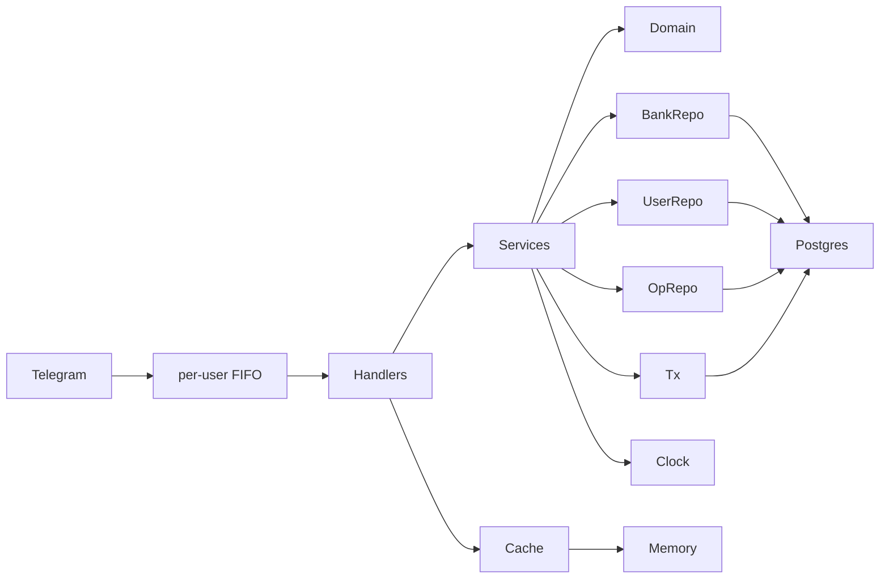

# Service and domain (current)

Hexagonal layout. Adapters on the outside, domain in the middle. **Interface per consumer** — the package that *calls* a dependency owns that interface. Tests mock that package’s interfaces, never a sibling layer’s.

The **service** layer depends on **domain + its own interfaces**, never on `ports`, Telegram types, or SQL types. Postgres implements the repo ports and is what `cmd/bot` opens.

Payment ports belong to `4.6`–`4.7`. Do not add them now.

```text
cmd/bot/main.go          # only binary until 4.21
internal/
  domain/            User, Bank, Money, Operation, errors, entitlement
  service/           use cases + BankRepository, UserRepository, OperationRepository, Transactor, Clock
  ports/             Cache, Notifier (Cache also exists so memorycache does not import telegram)
  adapter/
    telegram/        handlers, inline keyboards, conversation FSM, per-user pending FIFO; owns HTTPClient
    postgres/        runtime repos for `cmd/bot` (satisfy service repo interfaces)
    memorycache/     in-process Cache; owns Clock
    clock/           real clock
  config/            env-based config
  text/              locale-keyed strings (`en` only until 4.12)
```



## Driven dependencies (as code is now)

Owned by **service**:

- `BankRepository` — CRUD, list, total for included banks; **all methods take `userID`**
- `UserRepository` — upsert on first seen, update `LastActivityAt` (no `Get`; service does not read users back)
- `OperationRepository` — append-only operations
- `Transactor` — `InTx` for add/spend/set/delete/rename/transfer. Postgres retries up to 3 times on deadlock (`40P01`) and serialization (`40001`)
- `Clock` — `Now()` for activity and tests

Owned by **memorycache**:

- `Clock` — `Now()` for TTL expiry

Owned by **telegram**:

- `HTTPClient` — `Do(*http.Request)` for Bot API transport. Production uses `net/http`; tests use mockery.
- `Cache` — conversation FSM. Telegram owns the interface; `ports.Cache` remains so memorycache does not import telegram.

Still in **ports**:

- `Cache` — same interface, used by memorycache without importing telegram
- `Notifier` — send a message to a Telegram user (handlers; `/feedback` forward; inactivity job in `4.4`)

## Write path

Add/spend/set/delete/rename/transfer run in one `Transactor` transaction (balance change + operation row). `meta` snapshots the bank name as typed so `/history` still has a name after `ON DELETE SET NULL`.

`/transfer`: load the two banks by **ascending id** (so opposite transfers cannot deadlock), then apply from/to updates. One `operations` row on the from-bank (`meta` = to-bank id).

Do **not** store money as `float64`. Do not put Telegram `Update` types inside `service/`.

## Domain sketches

```go
type UserID int64

type Money int64 // cents

type Bank struct {
    ID             int64
    UserID         UserID
    Name           string
    Balance        Money
    IncludeInTotal bool
    Currency       string // unused in copy until 4.13
    CreatedAt      time.Time
    UpdatedAt      time.Time
}

type User struct {
    TelegramID      UserID
    Username        string
    LastActivityAt  time.Time
    Plan            string // "trial" now; paid plans in 4.7
    TrialEndsAt     time.Time
    DiscountPercent *int // nil = not whitelisted; 100 = free; 50 = 50% off
    Locale          string // default "en"
    ReferredBy      *UserID // set once from /start payload
    CreatedAt       time.Time
    UpdatedAt       time.Time
}
```

Parse user amounts (`100`, `100.5`, `100.50`) into cents; reject more than 2 decimal places.

## Layer rules

- Match clean Go: small files, no comments on obvious code, no one-use aliases
- **Interface per consumer:** define the smallest interface the caller needs in the caller’s package; generate mocks next to that package
- Service must not import `ports`, `database/sql`, Postgres, or Telegram packages
- Adapters depend inward (e.g. postgres compile-check against `service.BankRepository`)
- Repositories return domain types
- User-facing copy only in `internal/text`
- Reusable tokens live in `domain` as consts: `Yes` / `No`, and command names used in more than one place (`newbank`, `add`, `spend`, `set`, `delete`, `bank`, `banks`, `total`, `all`, `rename`, `transfer`). Handler-only names (`start`, `help`, `cancel`, `feedback`) stay in telegram.
- Do not extend tech debt: if a shortcut fights the architecture, fix the design
- Tests describe business rules, not line coverage
- Tests of layer X import `X/mocks`, never another layer’s mocks
- Unit tests use mockery for every mockable consumer interface. Custom doubles require a reason and user approval.
- Mocks live next to the consumer (`internal/service/mocks`, `internal/adapter/memorycache/mocks`, `internal/adapter/telegram/mocks`, `internal/ports/mocks`, …). Service tests must not import `ports/mocks`.
