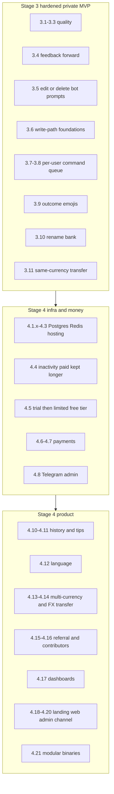

# Product requirements

Locked rules and the product roadmap. Current technical state lives in `docs/sdd/areas/`. Upcoming work lives in `docs/sdd/steps/`.

Do not reopen locked decisions unless the user changes them. Log changes in `docs/sdd/legacy/decisions-log.md` (historical; do not read that directory to implement a step).

## Vision

Telegram bot that lets a user split money into named **banks** (Travelling, Gifts, Live, Unplanned, …), change balances, and see totals. Some banks count toward the global total; some do not.

**Stages 0–3 (done):** clean Go, per-user SQLite, full bank CRUD/ops via Telegram, then a hardened private MVP (lint, persistence, docs, feedback, chat hygiene, write-path foundations, per-user command queue, sparse emojis, `/rename`, same-currency `/transfer`). Everyone still has **full banks**. No paywall.

**Stage 4 (public product):** Postgres, Redis, hosting, trial → limited free tier, payments, Telegram admin, history/tips, i18n, multi-currency, growth programs, dashboards, landing + web admin + channel, then a modular monolith (`cmd/bot`, `cmd/worker`, `cmd/web`). Extract network microservices only if load or team size requires it.

Step numbering: `2.x` is the Telegram MVP stage. Product “stage 2” is `4.x`.

## Stage 3 vs Stage 4 (placement)

- **Stage 3:** private-use bot still has **full banks**. No paywall. Add UX polish plus schema/ports that are painful to retrofit (especially an operations log).
- **Stage 4, with a Stage 3 stub:** product feature later; Stage 3 only stores the field / writes the row / keeps a no-op checker.
- **Stage 4 only:** needs billing, a public site, or a second surface (web admin, dashboards, channel).
- **Do not split into microservices in Stage 3 or early Stage 4.** Hexagonal packages already are the seam. Last Stage 4 step is a **modular monolith** (extra `cmd/` binaries). Real service extraction is optional after load/team pain.

| Idea | Stage 3 (now) | Stage 4 |
| --- | --- | --- |
| Feedback | `/feedback` forwards to `ADMIN_TELEGRAM_ID` via existing `Notifier`. No inbox table. | Persist feedback; admin inbox (Telegram first, web when `4.19` exists). |
| Chat flooding | Wizard prompts edited in place or deleted; typed answers in a flow deleted. Slash commands and outcomes stay. See [`areas/telegram.md`](areas/telegram.md). | Only if hygiene needs a second pass. |
| Command order | Per-user FIFO pending queue in the telegram adapter. Collapse only the obvious burst no-ops. See [`areas/telegram.md`](areas/telegram.md). | Multi-replica locking if `4.9` ever runs more than one bot process. |
| Emojis | Sparse office/finance emojis in `internal/text`. See [`areas/telegram.md`](areas/telegram.md). | Other language catalogs in `4.12` reuse the same emojis. |
| Rename bank | `/rename` pick → new name. Recase of the same bank is allowed. Writes an `operations` row. | Limited free tier must not rename the reserved `Total` bank (`4.5`). |
| Transaction history | Append-only `operations` on add/spend/set/delete/rename/transfer. **No `/history`.** | `/history` (pagination/filters). |
| Finance tips | Nothing (needs history UX + enough data). | Rule-based tips from operations. LLM optional later, not required. |
| Language | `users.locale` default `en`; `internal/text` locale-keyed with **only English**. No `/language`. | `/language` with a short list (languages chosen at that step). |
| Currencies | `banks.currency` + `DEFAULT_CURRENCY`. UX still one currency; totals still sum. | Per-bank currency from a short list; totals grouped; mixed-currency grand total later. |
| Internal transfers | `/transfer` same currency, two-leg + one operation. | Cross-currency + hardcoded rates, then optional HTTP FX API. |
| Free tier | `Entitlement` helper always **full**. | After trial: unpaid = one bank named `Total`, only `/add` `/spend` `/set` (+ help/start/feedback/cancel). `/newbank` etc. promote paid. Trial / paid / 100% whitelist stay full. |
| Paid inactivity | Nothing extra (`Plan` / `LastActivityAt` already exist). | Amend `4.4`: paid and 100% whitelist kept longer (or exempt). Free/trial use the short window. Exact TTLs at that step. |
| Referral | Parse `/start <payload>` on **first** upsert; store `referred_by`. No rewards. | Codes, rewards (extra trial / discount) after billing. |
| Admin panel | `ADMIN_TELEGRAM_ID` (feedback + future admin). No panel. | `4.8` stays Telegram admin (whitelist, inspect). `4.19` web admin (feedback inbox, users, later dashboards). |
| Dashboards | Consistent `slog` fields (`user_id`, command). No metrics stack. | Usage, Bot API, payments. Backend TBD at the step. |
| Landing site | Nothing. | Marketing site: product, plans (after `4.6`), bot link, channel link. |
| Telegram channel | Nothing. | Human: channel + discussion group, comments in the group only. Bot: link in `/start` `/help`. |
| Contributors | Nothing (`discount_percent` already covers manual 100% off). | Manual via admin first; optional GitHub link later. |
| Microservices | Keep one `cmd/bot`. Do not split. | `4.21` `cmd/bot`, `cmd/worker`, `cmd/web` sharing `internal/`. Extract network services only if `4.9`/`4.17` show a need. |
| Database | SQLite file, WAL, one writer, TEXT timestamps. | Postgres only after `4.1.3`. Compose + CI service in `4.1.1`. Adapter + row locks in `4.1.2`. Cutover in `4.1.3`. Managed DB in `4.3`. Partitioning in `4.9`. |

## Locked product decisions

- **Name / path:** `finbot` at `~/Projects/finbot`
- **Language of product:** Go 1.27
- **Isolation:** every row scoped by Telegram user ID; never leak another user’s banks
- **UX:** slash commands + inline buttons. Example: `/add` → tap bank → type amount. Shortcuts allowed: `/add Travelling 100`. Bank names may contain spaces. Command-line args after `/newbank` are the **entire name**; include-in-total is never parsed from that line.
- **Bot language:** English through Stage 3. All user-facing strings live in `internal/text`. Catalog is locale-keyed with **only `en` loaded**. `/language` and extra catalogs are `4.12`.
- **Chat hygiene:** keep slash commands, outcomes, `/feedback` body, and `Canceled.`. Edit one bot prompt per flow; delete typed answers. Policy: [`areas/telegram.md`](areas/telegram.md).
- **Command order:** one in-memory FIFO of pending updates **per Telegram user** in the telegram adapter (not Cache, not the database). Details: [`areas/telegram.md`](areas/telegram.md).
- **Emojis:** sparse, office/finance style. No emoji on errors, wizard prompts, or `/help` lines. Baseline: [`areas/telegram.md`](areas/telegram.md).
- **Remove bank:** delete the bank and its balance (not reset-to-zero)
- **Rename bank:** `/rename` picks a bank then asks for the new name (shortcut: `/rename Travelling`). If the full arg is not a bank, `/rename Travelling Holiday` renames bank `Travelling` to `Holiday`. Unique per user stays case-insensitive. Recasing the same bank is allowed.
- **Include in total:** asked when creating a bank; user can toggle later (`/toggle`)
- **Money:** `int64` minor units (cents). Display as `123.45`. No multi-currency **UX** until `4.13`. Banks already store `currency` (hidden in copy; totals still sum). FX / cross-currency transfer is `4.13`–`4.14`.
- **Negative balances:** allowed. **Negative add/spend amounts are invalid**; use `/spend` / `/set` instead
- **Bank names:** unique per user, compared case-insensitively. Unicode allowed. Store the name as the user typed it
- **Operations log:** append-only on add/spend/set/delete/rename/transfer. **No `/history` until `4.10`.** Finance tips are `4.11`.
- **Auth:** Telegram user ID is identity. No extra login
- **Stage 4 database:** PostgreSQL only (not MongoDB, not a long-lived SQLite fallback). Current store is SQLite until `4.1.3`. Work is split: `4.1.1` Compose/CI/`Open`/baseline schema; `4.1.2` same repository ports + `FOR UPDATE` / lock order / deadlock retry; `4.1.3` wire `cmd/bot` and delete the SQLite adapter from the runtime. Baseline Postgres schema — do not replay SQLite `001`–`003`. Local Compose; CI uses a GitHub Actions Postgres service. SQLite → Postgres copy is best-effort (no real users; data loss is acceptable). Managed hosting, TLS, backups → `4.3`. Partitioning, PgBouncer, replicas, rate limits → `4.9`. Design: [`docs/superpowers/specs/2026-09-09-postgresql-migration-design.md`](../superpowers/specs/2026-09-09-postgresql-migration-design.md).
- **Trial:** duration configurable (`TRIAL_DURATION`, default **7 days**). `0` means no trial. Negative values are rejected. `trial_ends_at` is **frozen at first signup**. Enforcement is `4.5`; how the helper behaves today: [`areas/billing.md`](areas/billing.md).
- **Whitelist:** not a boolean. Admin assigns a **discount percent** per user: `100` = totally free, `50` = 50% off, or any 0–100. `NULL` = not on the whitelist. Enforcement `4.5`+.
- **Post-trial UX (`4.5`):** unpaid users get a **limited free tier**, not a hard block. One bank named `Total`; only `/add` `/spend` `/set` plus `/start` `/help` `/feedback` `/cancel`. Extra-bank commands promote paid. Trial, paid, and 100% whitelist stay full.
- **Paid inactivity (`4.4`):** paid users and 100% whitelist are kept longer (or exempt). Free/trial use the short warn-then-delete window. Exact TTLs at that step.
- **Payment strategy:** dedicated step `4.6`. Provider, prices, and checkout flow are **TBD with the user** before that step. Do not pick Stripe vs Telegram Stars vs something else now.
- **Deployment shape:** one `cmd/bot` now. Stay a **modular monolith** through `4.21` (`cmd/bot`, `cmd/worker`, `cmd/web` sharing `internal/`) unless `4.9`/`4.17` show a need to extract network services.

## Entitlement

Access after Stage 3 is decided in this order:

1. **In trial** (`now < TrialEndsAt`) → full access, free
2. **Whitelist 100%** (`DiscountPercent == 100`) → full access, free, no time limit
3. **Paid** (active plan from `4.7`) → full access
4. **Whitelist 1–99%** → after trial, limited free tier until they pay the discounted price from `4.6` / `4.7`; then full access
5. **No whitelist, trial over, not paid** → **limited free tier** (not a hard block): one bank named `Total`; only `/add` `/spend` `/set` plus `/start` `/help` `/feedback` `/cancel`. Commands that need extra banks (`/newbank`, `/delete`, `/toggle`, `/rename`, `/transfer`, …) promote paid features.

Today the helper always returns full access. See [`areas/billing.md`](areas/billing.md). Owner must whitelist themselves at 100% before enabling `4.5`.

Admin can add, change, or revoke a user’s discount at any time (`4.8`).
