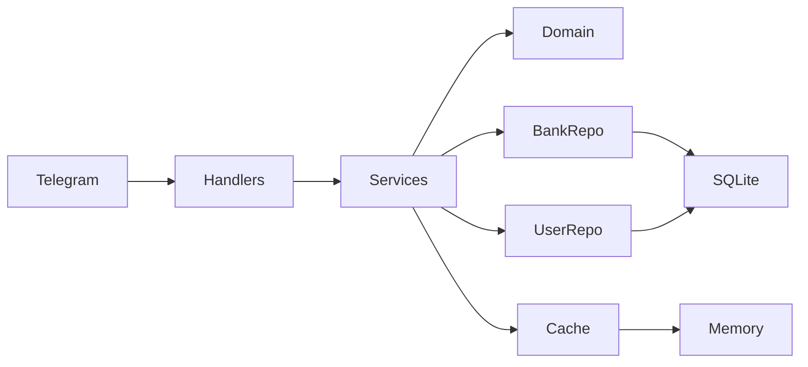

# Finbot — living plan

This file is the source of truth for the project. An agent that lost prior chat context should be able to continue from here alone.

## Status header (keep this current)

| Field | Value |
| --- | --- |
| **Current step** | `1.8` |
| **Last done** | `1.7` Service use cases |
| **MVP target** | private-use Telegram finance bot in Go + SQLite |
| **GitHub** | `undochlorine/finbot` exists; do not push unless asked |
| **Go module** | `finbot` until a remote exists |
| **Path** | `/Users/a.sicaci/Projects/finbot` |

**Status values:** `todo` | `to review` | `done`

### Agent protocol

1. User says `let's move to step x.y`.
2. Read this file. Implement **only** that step.
3. Mark the step `to review`. Update **Current step** / **Last done** in the header.
4. User accepts → mark `done`. Next `todo` becomes the pointer.
5. Do not start later steps unless asked. Do not skip DoD.
6. After a logical code scope: `golangci-lint run --config ~/Projects/golangci.yaml` (required from step `1.x` onward whenever Go code changes).
7. Do not create a GitHub remote or commit unless the user asks.
8. Tests: table-driven unit tests for business logic; integration tests against a temp SQLite file (no docker-compose in MVP).

### How to pick up work

Say: `let's move to step 1.8` (next). Or any other id, e.g. `let's move to step 2.4`.

---

## Vision

Telegram bot that lets a user split money into named **banks** (Travelling, Gifts, Live, Unplanned, …), change balances, and see totals. Some banks count toward the global total; some do not.

**Stage 1 (MVP):** clean Go, per-user SQLite persistence, full bank CRUD/ops via Telegram.

**Stage 2 (designed now, built later):** PostgreSQL, Redis, cheap scalable hosting, inactivity notify+delete, configurable trial (default 1 week), payment strategy, billing, admin-controlled whitelist privileges (free / % off), load resistance.

---

## Locked product decisions

Do not reopen these unless the user changes them. Log any change under [Decisions log](#decisions-log).

- **Name / path:** `finbot` at `~/Projects/finbot`
- **Language of product:** Go 1.27
- **MVP database:** SQLite file on disk (server reload must not lose data)
- **Isolation:** every row scoped by Telegram user ID; never leak another user’s banks
- **UX:** slash commands + inline buttons. Example: `/add` → tap bank → type amount. Shortcuts allowed: `/add Travelling 100`
- **Bot language:** English. All user-facing strings live in `internal/text` so i18n can be added later
- **Remove bank:** delete the bank and its balance (not reset-to-zero)
- **Include in total:** asked when creating a bank; user can toggle later (`/toggle`)
- **Money:** `int64` minor units (cents). Display as `123.45`. No FX / multi-currency in MVP (implicit single currency)
- **Negative balances:** allowed (personal tracking, not a hard wallet)
- **Bank names:** unique per user, compared case-insensitively. Unicode allowed. Store the name as the user typed it
- **No operation/transaction history in MVP.** Domain should stay easy to add an `Operation` log later
- **Auth:** Telegram user ID is identity. No extra login
- **GitHub:** local git only until the user asks to create a private repo
- **Stage 2 database:** PostgreSQL preferred over MongoDB (relational users + banks)
- **Trial (stage 2, schema from MVP):** duration is configurable (`TRIAL_DURATION`, default **7 days**). `0` means no trial. Negative values are rejected. `trial_ends_at` is **frozen at first signup** so changing the default later does not rewrite existing users.
- **Whitelist (stage 2, schema from MVP):** not a boolean. Admin assigns a **discount percent** per user: `100` = totally free, `50` = 50% off, `30` = 30% off, or any 0–100. `NULL` = not on the whitelist (pays full price after trial)
- **Payment strategy (stage 2):** dedicated step `4.6`. Provider, prices, and checkout flow are **TBD with the user** before that step is implemented. Do not pick Stripe vs Telegram Stars vs something else in MVP
- **Log level:** `LOG_LEVEL` is `debug`, `info`, `warn`, or `error` (default `info`). Invalid values fail startup.

---

## Architecture (from day 1)

Hexagonal / ports-and-adapters. The **service** layer depends on **domain + ports**, never on Telegram types or SQL types.

```text
cmd/bot/main.go
internal/
  domain/            User, Bank, Money, errors
  ports/             BankRepository, UserRepository, Cache, Clock, Notifier
  service/           use cases
  adapter/
    telegram/        handlers, inline keyboards, conversation FSM
    sqlite/          migrations + repositories
    memorycache/     in-process Cache (Redis later)
    clock/           real clock
  config/            env-based config
  text/              English strings
```



### Ports (define in MVP even if some impls are trivial)

- `BankRepository` — CRUD, list, total for included banks; **all methods take `userID`**
- `UserRepository` — upsert on first seen, update `LastActivityAt`, read user
- `Cache` — conversation FSM (which bank, which action, waiting for amount/name). TTL. RAM in MVP, Redis in stage 2
- `Clock` — `Now()` for activity and tests
- `Notifier` — send a message to a Telegram user (used by handlers now; inactivity job in stage 2)

### Stage-2 hooks that must exist in MVP (unused or no-op is OK)

- `User.LastActivityAt` updated on every successful interaction
- `User.Plan` stored (e.g. `trial` / `free` in MVP; paid plans later). **Do not enforce a paywall in MVP**
- `User.TrialEndsAt` set **once** on first upsert (`now + TRIAL_DURATION`). Never refresh it on later messages
- `User.DiscountPercent` optional (`*int`): `nil` = not whitelisted; `100` = free; `50` / `30` / custom = that % off after trial. Unused in MVP
- Config `TRIAL_DURATION` (default `168h` / 7 days) loaded in `0.2` even though trial is not enforced until `4.5`
- `ports.Cache` with memory implementation
- `Clock` interface
- Env config + Dockerfile (12-factor; hosting is stage 2)
- Every SQL query filtered by `user_id`

Do **not** add a Billing port in MVP. Entitlement/payment ports belong to `4.5`–`4.7`.

### Tech choices (MVP)

| Concern | Choice | Why |
| --- | --- | --- |
| Go | 1.27 | Locked for module, Docker, and local run |
| SQLite driver | `modernc.org/sqlite` | Pure Go, simpler Docker |
| SQLite mode | WAL | Safer concurrent reads |
| Migrations | numbered SQL files applied at startup | No extra migrator yet |
| Telegram | `github.com/go-telegram/bot` | Handlers + inline keyboards |
| Conversation state | `ports.Cache` + short TTL | Swap to Redis later |
| Tests | table-driven `service/` unit tests; temp SQLite integration | Matches DoD without docker-compose |
| Mocks | mockery on ports if the repo already uses it; otherwise hand-written fakes in tests | Keep tests about business logic |

### What not to do in MVP

- No Redis, Postgres, paywall, payments, admin bot, inactivity sweeper, rate limiter, horizontal DB partitioning
- Trial and whitelist **columns/config exist**; they are not enforced until stage 2 (`4.5`+)
- No docker-compose required (SQLite file is enough). A Dockerfile is still added so stage 2 hosting is not a rewrite
- Do not put Telegram `Update` types inside `service/`
- Do not store money as `float64`

---

## Data model (MVP)

### users

- `telegram_id` INTEGER PRIMARY KEY
- `username` TEXT
- `last_activity_at` TEXT (RFC3339 UTC)
- `plan` TEXT NOT NULL DEFAULT `'trial'`
- `trial_ends_at` TEXT (RFC3339 UTC); set once at insert
- `discount_percent` INTEGER NULL — `NULL` = not whitelisted; `0`–`100` = admin privilege (`100` = free)
- `created_at`, `updated_at` TEXT (RFC3339 UTC)

### banks

- `id` INTEGER PRIMARY KEY AUTOINCREMENT
- `user_id` INTEGER NOT NULL REFERENCES users
- `name` TEXT NOT NULL
- `balance_cents` INTEGER NOT NULL DEFAULT `0`
- `include_in_total` INTEGER NOT NULL
- `created_at`, `updated_at`
- UNIQUE `(user_id, name_normalized)` extra column (not a generated `lower(name)`), filled by the app with `NormalizeBankName` so Unicode case-folding matches the domain

### Total

```sql
SELECT COALESCE(SUM(balance_cents), 0)
FROM banks
WHERE user_id = ? AND include_in_total = 1;
```

### Domain sketches (implement in 1.1)

```go
type UserID int64

type Money int64 // cents

type Bank struct {
    ID             int64
    UserID         UserID
    Name           string
    Balance        Money
    IncludeInTotal bool
    CreatedAt      time.Time
    UpdatedAt      time.Time
}

type User struct {
    TelegramID      UserID
    Username        string
    LastActivityAt  time.Time
    Plan            string // "trial" in MVP; paid plans in 4.7
    TrialEndsAt     time.Time
    DiscountPercent *int // nil = not whitelisted; 100 = free; 50 = 50% off
    CreatedAt       time.Time
    UpdatedAt       time.Time
}
```

Parse user amounts (`100`, `100.5`, `100.50`) into cents; reject more than 2 decimal places.

### Entitlement (stage 2 — document now, enforce in `4.5`+)

Access after MVP is decided in this order:

1. **In trial** (`now < TrialEndsAt`) → full access, free
2. **Whitelist 100%** (`DiscountPercent == 100`) → full access, free, no time limit
3. **Whitelist 1–99%** → after trial, pays the discounted price from the payment strategy (`4.6` / `4.7`)
4. **No whitelist, trial over** → must pay full price (or be blocked / limited). Exact post-trial UX (hard block vs nag vs read-only) is decided with the user in `4.5`

Admin can add, change, or revoke a user’s discount at any time (`4.8`).

---

## Telegram surface (MVP)

Register these with BotFather when running locally (step `3.3`).

| Command | Flow |
| --- | --- |
| `/start` | Upsert user, short intro, point to `/help` |
| `/help` | List commands |
| `/newbank` | Ask name → ask “Count in total?” yes/no buttons. Shortcut: `/newbank Travelling` then still ask include flag (or `/newbank Travelling yes`) |
| `/add` | Pick bank (buttons or arg) → amount. Adds to balance |
| `/spend` | Same as add, subtracts (negative allowed) |
| `/set` | Pick bank → amount. Sets absolute balance |
| `/delete` | Pick bank → confirm button → delete bank |
| `/bank` | Pick bank or arg → show one bank |
| `/toggle` | Pick bank → flip `include_in_total` → confirm new state |
| `/banks` | List all banks (name, balance, whether in total) |
| `/total` | Sum of included banks only |
| `/all` | Full list + total |

**Empty state:** if the user has no banks, mutating/list commands say so and point to `/newbank`.

**Shortcuts:** `/add Travelling 100`, `/spend Gifts 12.50`, `/set Live 0`, `/bank Travelling`, `/delete Travelling`.

**Callback data:** versioned and namespaced, e.g. `v1:add:<bankID>`, so stage 2 can change without colliding.

### Error / edge cases (handlers + service)

- Duplicate bank name (case-insensitive) → clear error, do not overwrite
- Unknown bank → error, offer `/banks`
- Invalid amount (empty, `abc`, `1.234`, overflow) → error, ask again
- Delete last bank → allowed
- Concurrent updates from the same user → last SQLite write wins; acceptable for MVP
- Very large amounts → reject if cents would overflow `int64`
- User with zero banks asking `/total` → `0.00` (or “no banks yet” — pick one in `2.7` and document in decisions log)

---

## Layer rules (code style)

- Match clean Go: small files, no comments on obvious code, no one-use aliases
- Service must not import `database/sql`, SQLite, or Telegram packages
- Repositories return domain types
- User-facing copy only in `internal/text`
- Do not extend tech debt: if a shortcut fights the architecture, fix the design
- Tests describe business rules, not line coverage

---

## Local run (filled in as steps complete)

Until step `3.3`:

```bash
export BOT_TOKEN=...          # or put it in .env
export SQLITE_PATH=./data/finbot.db
export LOG_LEVEL=info         # debug | info | warn | error
export TRIAL_DURATION=168h    # optional; 0 = no trial; default 7 days; enforced only in 4.5
go run ./cmd/bot
```

---

## Decisions log

| Date | Decision |
| --- | --- |
| 2026-09-06 | Project name `finbot`; remove bank = delete entirely; commands + inline buttons; include-in-total at create + toggle later; English MVP; GitHub later; SQLite MVP; Postgres for stage 2; negative balances allowed; money as cents |
| 2026-09-06 | Stage 2 monetization: configurable trial (default 7 days, frozen as `trial_ends_at` at signup); whitelist is a per-user discount 0–100% (100 = free); explicit payment-strategy step `4.6` with provider TBD later |
| 2026-09-06 | `TRIAL_DURATION=0` means no trial; negatives rejected. `LOG_LEVEL` constrained to debug/info/warn/error from MVP. Local `.env` is loaded if present (real env wins). No `.gitkeep` placeholders. |
| 2026-09-06 | SQLite timestamps are TEXT RFC3339 UTC. `name_normalized` is an app-written column (Unicode-aware), not SQLite `lower()`. `ON DELETE CASCADE` from banks to users. |
| 2026-09-06 | Go 1.27 everywhere (`go.mod`, Dockerfile, README). |

---

## Steps

Implement one id at a time. Update the status field in place.

---

### Stage 0 — Setup

#### 0.1 Go module and directory skeleton

- **Status:** `done`
- **Goal:** `go mod init finbot` and empty package dirs so later steps have a home.
- **Files:** `go.mod`; `cmd/bot/`; `internal/{domain,ports,service,config,text,adapter/telegram,adapter/sqlite,adapter/memorycache,adapter/clock}/`
- **DoD:** `go mod init` succeeded; dirs exist; no application logic yet.

#### 0.2 Env config and gitignore

- **Status:** `done`
- **Goal:** 12-factor config from env; secrets never committed.
- **Files:** `internal/config/config.go`; `.env.example`; `.gitignore` (binaries, `.env`, `data/*.db`, IDE)
- **DoD:** config loads `BOT_TOKEN` (required; from process env or `.env`), `SQLITE_PATH` (default `./data/finbot.db`), `LOG_LEVEL` (`debug`/`info`/`warn`/`error`, default `info`), `TRIAL_DURATION` (default `168h`; `0` = no trial; negative rejected). Missing token is a clear startup error. `.env` is gitignored. Trial duration is stored for later; **do not enforce a paywall**.

#### 0.3 Dockerfile

- **Status:** `done`
- **Goal:** multi-stage image for later cheap hosting; not deployed in MVP.
- **Files:** `Dockerfile`; `.dockerignore`
- **DoD:** image builds a static-ish Go binary; SQLite path and token via env; data dir is a volume path.

#### 0.4 README skeleton

- **Status:** `done`
- **Goal:** enough for a human (or future agent) to know what this is and how to run it later.
- **Files:** `README.md`
- **DoD:** purpose, architecture one-liner, pointer to `plan.md`, env vars listed (including `TRIAL_DURATION`). Full run checklist can wait for `3.3`.

---

### Stage 1 — Domain and persistence

#### 1.1 Domain entities and errors

- **Status:** `done`
- **Goal:** `User` (including `TrialEndsAt`, `DiscountPercent`), `Bank`, `Money` helpers, domain errors (`ErrBankNotFound`, `ErrBankNameTaken`, `ErrInvalidAmount`, …).
- **Files:** `internal/domain/*.go` (+ tests for money parse/format)
- **DoD:** parse/format cents covered by table tests; no IO.

#### 1.2 Ports

- **Status:** `done`
- **Goal:** interfaces only.
- **Files:** `internal/ports/*.go`
- **DoD:** `BankRepository`, `UserRepository`, `Cache`, `Clock`, `Notifier` defined with `context.Context` on IO methods.

#### 1.3 SQLite migrations

- **Status:** `done`
- **Goal:** `users` + `banks` tables; apply on open.
- **Files:** `internal/adapter/sqlite/migrations/*.sql`; migrate runner
- **DoD:** opening a new DB creates schema (`users` includes `trial_ends_at` and `discount_percent`; `banks` as specified); re-open is idempotent; unique per-user bank name enforced.

#### 1.4 SQLite repositories

- **Status:** `done`
- **Goal:** concrete `BankRepository` and `UserRepository`.
- **Files:** `internal/adapter/sqlite/*.go`
- **DoD:** all queries include `user_id` where data is per-user; WAL enabled.

#### 1.5 Memory cache adapter

- **Status:** `done`
- **Goal:** in-process `ports.Cache` with TTL for FSM keys.
- **Files:** `internal/adapter/memorycache/*.go` (+ tests)
- **DoD:** set/get/delete; expired keys treated as miss.

#### 1.6 Clock adapter

- **Status:** `done`
- **Goal:** real `time.Now` behind `ports.Clock`; tests can fake it later.
- **Files:** `internal/adapter/clock/*.go`

#### 1.7 Service use cases

- **Status:** `done`
- **Goal:** create/add/spend/set/delete/get/list/total/all/toggle; upsert user (set `TrialEndsAt` only on insert); touch activity.
- **Files:** `internal/service/*.go`
- **DoD:** no Telegram/SQL imports. Duplicate name and not-found map to domain errors. Total sums only `IncludeInTotal` banks.

#### 1.8 Service unit tests

- **Status:** `todo`
- **Goal:** table-driven tests of business rules with fake ports.
- **Files:** `internal/service/*_test.go`
- **DoD:** covers create, duplicate name, add/spend/set, delete, toggle, total vs excluded bank, empty list. Tests pass (`go test ./internal/service/...`).

#### 1.9 SQLite integration tests

- **Status:** `todo`
- **Goal:** real temp DB file (or `:memory:` if WAL/constraints still apply — prefer temp file to match persistence).
- **Files:** `internal/adapter/sqlite/*_test.go`
- **DoD:** two users cannot see each other’s banks; unique name; restart-open of the same file still has data. Tests pass. No docker-compose.

---

### Stage 2 — Telegram bot (MVP product)

Numbering is `2.x` for the Telegram stage (not “stage 2” of the product roadmap; that is `4.x`).

#### 2.1 Bot wiring

- **Status:** `todo`
- **Goal:** `main` loads config, opens SQLite, builds services, starts long polling, graceful shutdown.
- **Files:** `cmd/bot/main.go`; `internal/adapter/telegram/` bootstrap
- **DoD:** process starts with a token; exits non-zero if token/DB missing. No feature complete yet except process health.

#### 2.2 Activity + user upsert middleware

- **Status:** `todo`
- **Goal:** every inbound update upserts the user and sets `LastActivityAt`. First insert sets `TrialEndsAt = now + TRIAL_DURATION` and must not overwrite it later.
- **Files:** telegram middleware / handler wrapper
- **DoD:** first `/start` creates a `users` row with `trial_ends_at` populated. Second message does not extend the trial.

#### 2.3 `/start` and `/help`

- **Status:** `todo`
- **Goal:** English copy from `internal/text`.
- **Files:** `internal/text`, telegram handlers
- **DoD:** both commands reply; help lists all MVP commands.

#### 2.4 `/newbank` flow

- **Status:** `todo`
- **Goal:** FSM: name → include-in-total buttons; shortcuts if args present.
- **DoD:** bank persisted; duplicate name errors in chat.

#### 2.5 `/add`, `/spend`, `/set`

- **Status:** `todo`
- **Goal:** bank picker buttons or args; then amount; cache FSM.
- **DoD:** balances change correctly; invalid amount re-prompted; empty banks → hint `/newbank`.

#### 2.6 `/delete`

- **Status:** `todo`
- **Goal:** pick bank, confirm, delete entirely.
- **DoD:** bank gone from list; confirm step avoids accidental taps.

#### 2.7 `/bank`, `/banks`, `/total`, `/all`

- **Status:** `todo`
- **Goal:** read-only views; `/all` = list + total of included banks.
- **DoD:** excluded banks show in list but not in total.

#### 2.8 `/toggle`

- **Status:** `todo`
- **Goal:** flip `include_in_total`; reply with new state.
- **DoD:** `/total` changes after toggle without changing balances.

#### 2.9 Conversation FSM polish

- **Status:** `todo`
- **Goal:** TTL expiry, cancel (`/cancel`), ignore stale callback data, don’t mix two in-flight flows.
- **DoD:** starting `/add` then `/spend` replaces the pending flow; expired state asks the user to start over.

---

### Stage 3 — MVP harden

#### 3.1 Lint

- **Status:** `todo`
- **Goal:** `golangci-lint run --config ~/Projects/golangci.yaml` → 0 issues.
- **DoD:** command run on the module; issues fixed.

#### 3.2 Persistence check

- **Status:** `todo`
- **Goal:** kill and restart the process against the same `SQLITE_PATH`; banks remain.
- **DoD:** documented in README how to verify; agent or user actually ran it once.

#### 3.3 Local run docs

- **Status:** `todo`
- **Goal:** BotFather steps, command list, env, `go run ./cmd/bot`.
- **Files:** `README.md`
- **DoD:** a new machine can run MVP from README + a token.

**MVP is complete when 0.1–3.3 are `done`.**

---

### Stage 4 — Product stage 2 (not MVP)

Architecture is already shaped so these are adapter/job additions, not a rewrite. Leave `todo` until the user starts this stage.

Monetization sequence (do not skip `4.6`):

1. `4.5` trial enforcement
2. `4.6` payment strategy (blocked on a conversation with the user)
3. `4.7` billing against that strategy
4. `4.8` admin whitelist privileges (`100` / `50` / `30` / custom % off)

#### 4.1 PostgreSQL adapter

- **Status:** `todo`
- **Goal:** implement the same repository ports on Postgres; keep SQLite behind a config switch or drop it.
- **Notes:** migrate schema; integration tests will need compose or a testcontainer — **ask the user** which they prefer before adding compose.

#### 4.2 Redis cache

- **Status:** `todo`
- **Goal:** `ports.Cache` on Redis for FSM and any hot totals; replace memory adapter in production.

#### 4.3 Cheap hosting that can scale

- **Status:** `todo`
- **Goal:** run app + DB with a low bill (Fly.io / Railway / Hetzner-class VPS — choose at the time). Dockerfile already exists. Stateless app, mounted or managed DB.

#### 4.4 Inactivity notify and delete

- **Status:** `todo`
- **Goal:** job uses `LastActivityAt`: warn (e.g. 1 week to deletion), then delete that user’s banks + user row. `Notifier` sends the warning via Telegram.
- **Note:** whether 100% whitelist or paid users are exempt is decided with the user at the start of this step (see also `4.8`).

#### 4.5 Trial period (enforce)

- **Status:** `todo`
- **Goal:** the bot is free during the user’s trial (`now < TrialEndsAt`). Duration comes from `TRIAL_DURATION` (default 7 days) and was frozen at signup. After the trial, access follows the [entitlement order](#entitlement-stage-2--document-now-enforce-in-45): whitelist 100% stays free; discounted whitelist pays less; everyone else must pay or lose full access.
- **DoD:** config change only affects **new** users. Existing `trial_ends_at` is never rewritten by config. Unit tests cover in-trial / expired / 100% off / % off / no whitelist. **Ask the user** before choosing hard-block vs nag vs read-only after expiry.
- **Depends on:** schema already in MVP; payment collection itself is `4.6` / `4.7`.

#### 4.6 Payment strategy

- **Status:** `todo`
- **Goal:** **explicit product step.** Choose and implement how money is collected (provider, currency, one-time vs subscription, when to charge, receipts, failed payment). Details will be clarified with the user immediately before this step — **do not invent Stripe / Telegram Stars / crypto / etc. in advance**.
- **DoD:** a written strategy in this `plan.md` (decisions log + short subsection) **and** the agreed checkout/payment flow in code. Whitelist discounts from `4.8` must be applicable to whatever price model is chosen (100% → charge nothing; 50% → half price; 30% → 70% of list price).
- **Blocked until:** user clarifies provider, pricing, and subscription vs one-time.

#### 4.7 Billing implementation

- **Status:** `todo`
- **Goal:** wire `User.Plan` (and paid-through dates if needed) to the strategy from `4.6`. Trial + whitelist + paid state must compose using the entitlement order. Webhooks/reconciliation as required by the chosen provider.
- **DoD:** a user can move trial → paid (full or discounted) → (optional) lapsed, with tests. No paywall holes for expired non-whitelisted users once `4.5` UX is chosen.
- **Depends on:** `4.5`, `4.6`. Can land in the same iteration as `4.6` if the user wants, but keep the payment **strategy** decision explicit.

#### 4.8 Admin and whitelist privileges

- **Status:** `todo`
- **Goal:** admin can inspect users/data and **set whitelist privileges per user**: totally free (`100`), `50`% off, `30`% off, any other 0–100, or revoke (`NULL`). Privileges are stored as `discount_percent`, not a boolean. Admin UX TBD at the start of this step (gated commands vs a separate admin bot vs allowlist of Telegram admin IDs).
- **DoD:** admin can add / change / remove a privilege; the user’s next billing or access check uses the new percent. Changing privilege does not by itself rewrite `trial_ends_at`. Document whether 100% off also skips inactivity deletion (`4.4`) — **ask the user** if unclear.
- **Depends on:** `4.5`–`4.7` for paid/discounted behavior; admin CRUD of the field can be built as soon as the schema exists, but charging must wait for `4.6`.

#### 4.9 Load resistance

- **Status:** `todo`
- **Goal:** token bucket / rate limit per user, cache, app replicas, Postgres (later partitioning if needed). Don’t pre-build this in MVP.

---

## Suggested next message

`let's move to step 1.8`
