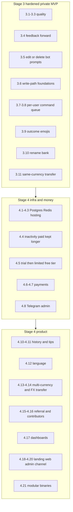
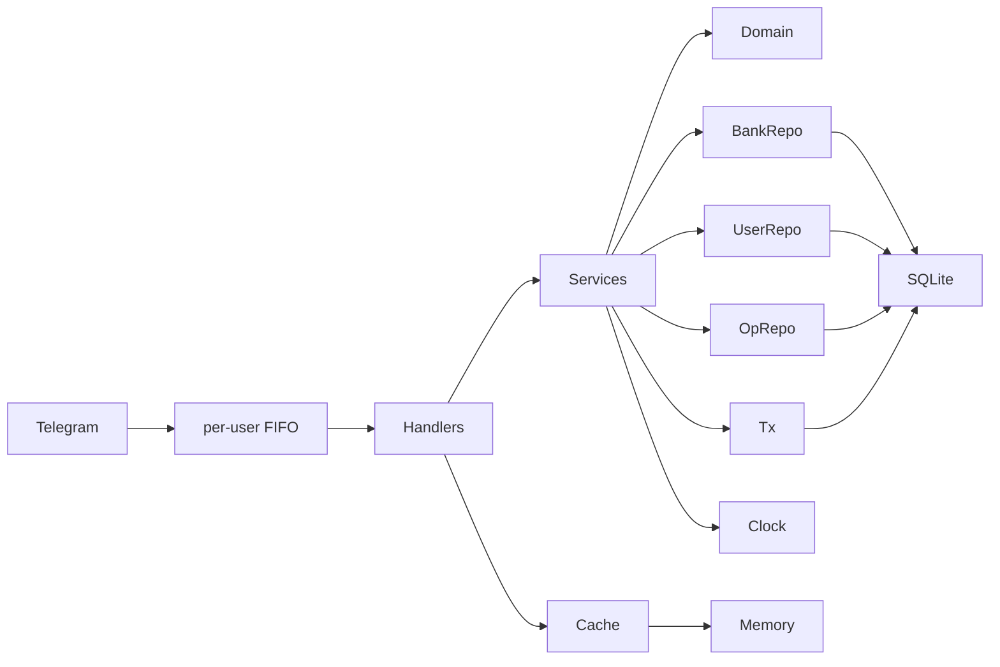

# Finbot — living plan

This file is the source of truth for the project. An agent that lost prior chat context should be able to continue from here alone.

## Status header (keep this current)

| Field | Value |
| --- | --- |
| **Current step** | `3.8` |
| **Last done** | `3.7` per-user FIFO pending commands |
| **MVP target** | private-use Telegram finance bot in Go + SQLite (hardened through `3.11`) |
| **GitHub** | `undochlorine/finbot` exists; do not push unless asked |
| **Go module** | `finbot` until a remote exists |
| **Path** | `/Users/a.sicaci/Projects/finbot` |

**Status values:** `todo` | `to review` | `done`

### Agent protocol

1. User says `let's move to step x.y`.
2. Read this file. Implement **only** that step.
3. Mark the step `to review`. Update **Current step** / **Last done** in the header.
4. User accepts → mark `done`. Next `todo` becomes the pointer.
5. Do not start later steps unless asked. Do not skip DoD.
6. After a logical code scope: `make lint` (required from step `1.x` onward whenever Go code changes).
7. Do not create a GitHub remote or commit unless the user asks.
8. Tests: table-driven unit tests for business logic with **mockery on the consumer’s interfaces**; integration tests against a temp SQLite file (no docker-compose in MVP). **Do not hand-write stubs/fakes/spies** for an interface mockery can generate. A custom test double needs a written reason **and explicit user approval** before it is added. Plain cases always use mockery. CI: `make test-unit`, `make lint`, `make test-integration` (see [CI](#ci-github-actions)).

### How to pick up work

Say: `let's move to step 3.8` (next). Or any other id, e.g. `let's move to step 2.9`.

---

## Vision

Telegram bot that lets a user split money into named **banks** (Travelling, Gifts, Live, Unplanned, …), change balances, and see totals. Some banks count toward the global total; some do not.

**Stages 0–2 (done):** clean Go, per-user SQLite persistence, full bank CRUD/ops via Telegram.

**Stage 3 (now):** harden the private MVP (lint, persistence, docs), then feedback, chat hygiene, write-path foundations, a per-user command queue, sparse emojis, `/rename`, and same-currency `/transfer`. Everyone still has **full banks**. No paywall.

**Stage 4 (public product):** Postgres, Redis, hosting, trial → limited free tier, payments, Telegram admin, history/tips, i18n, multi-currency, growth programs, dashboards, landing + web admin + channel, then a modular monolith (`cmd/bot`, `cmd/worker`, `cmd/web`). Extract network microservices only if load or team size requires it.

Step numbering: `2.x` is the Telegram MVP stage. Product “stage 2” is `4.x`.

### Stage 3 vs Stage 4 (placement)

- **Stage 3:** private-use bot still has **full banks**. No paywall. Add UX polish plus schema/ports that are painful to retrofit (especially an operations log).
- **Stage 4, with a Stage 3 stub:** product feature later; Stage 3 only stores the field / writes the row / keeps a no-op checker.
- **Stage 4 only:** needs billing, a public site, or a second surface (web admin, dashboards, channel).
- **Do not split into microservices in Stage 3 or early Stage 4.** Hexagonal packages already are the seam. Last Stage 4 step is a **modular monolith** (extra `cmd/` binaries). Real service extraction is optional after load/team pain.



| Idea | Stage 3 | Stage 4 |
| --- | --- | --- |
| Feedback | `/feedback` forwards to `ADMIN_TELEGRAM_ID` via existing `Notifier`. No inbox table. | Persist feedback; admin inbox (Telegram first, web when `4.19` exists). |
| Chat flooding | Wizard prompts are edited in place or deleted; typed answers in a flow are deleted. Slash commands and outcomes stay. See [Chat hygiene](#chat-hygiene-35). | Only if hygiene needs a second pass. |
| Command order | Per-user FIFO pending queue in the telegram adapter. Collapse only the obvious burst no-ops in `3.8`. See [Pending commands](#pending-commands-37--38). | Multi-replica locking if `4.9` ever runs more than one bot process. |
| Emojis | Sparse office/finance emojis in `internal/text`. Baseline in [Emojis](#emojis-39); more of the same family is allowed. Not on `/help` lines, errors, or wizard prompts. | Other language catalogs in `4.12` reuse the same emojis. |
| Rename bank | `/rename` pick → new name. Recase of the same bank is allowed. Writes an `operations` row. | Limited free tier must not rename the reserved `Total` bank (`4.5`). |
| Transaction history | Append-only `operations` on add/spend/set/delete/rename/(transfer). **No `/history`.** | `/history` (pagination/filters). |
| Finance tips | Nothing (needs history UX + enough data). | Rule-based tips from operations. LLM optional later, not required. |
| Language | `users.locale` default `en`; `internal/text` becomes locale-keyed with **only English**. No `/language`. | `/language` with a short list (languages chosen at that step). |
| Currencies | `banks.currency` + `DEFAULT_CURRENCY`. UX still one currency; totals still sum. | Per-bank currency from a short list; totals grouped; mixed-currency grand total later. |
| Internal transfers | `/transfer` same currency, two-leg + one operation (`3.11`). | Cross-currency + hardcoded rates, then optional HTTP FX API. |
| Free tier | `Entitlement` helper always **full**. | After trial: unpaid = one bank named `Total`, only `/add` `/spend` `/set` (+ help/start/feedback/cancel). `/newbank` etc. promote paid. Trial / paid / 100% whitelist stay full. |
| Paid inactivity | Nothing extra (`Plan` / `LastActivityAt` already exist). | Amend `4.4`: paid and 100% whitelist kept longer (or exempt). Free/trial use the short window. Exact TTLs at that step. |
| Referral | Parse `/start <payload>` on **first** upsert; store `referred_by`. No rewards. | Codes, rewards (extra trial / discount) after billing. |
| Admin panel | `ADMIN_TELEGRAM_ID` (feedback + future admin). No panel. | `4.8` stays Telegram admin (whitelist, inspect). `4.19` web admin (feedback inbox, users, later dashboards). |
| Dashboards | Consistent `slog` fields (`user_id`, command). No metrics stack. | Usage, Bot API, payments. Backend TBD at the step (Prometheus/Grafana vs admin pages). |
| Landing site | Nothing. | Marketing site: product, plans (after `4.6`), bot link, channel link. |
| Telegram channel | Nothing. | Human: channel + discussion group, comments in the group only. Bot: link in `/start` `/help`. |
| Contributors | Nothing (`discount_percent` already covers manual 100% off). | Manual via admin first; optional GitHub link later. |
| Microservices | Keep one `cmd/bot`. Do not split. | `4.21` `cmd/bot`, `cmd/worker`, `cmd/web` sharing `internal/`. Extract network services only if `4.9`/`4.17` show a need. |

---

## Locked product decisions

Do not reopen these unless the user changes them. Log any change under [Decisions log](#decisions-log).

- **Name / path:** `finbot` at `~/Projects/finbot`
- **Language of product:** Go 1.27
- **MVP database:** SQLite file on disk (server reload must not lose data)
- **Isolation:** every row scoped by Telegram user ID; never leak another user’s banks
- **UX:** slash commands + inline buttons. Example: `/add` → tap bank → type amount. Shortcuts allowed: `/add Travelling 100`. Bank names may contain spaces. Command-line args after `/newbank` are the **entire name**; include-in-total is never parsed from that line.
- **Bot language:** English through Stage 3. All user-facing strings live in `internal/text`. Step `3.6` keys the catalog by locale with **only `en` loaded** and stores `users.locale` (default `en`). `/language` and extra catalogs are `4.12`.
- **Chat hygiene:** keep slash commands, outcomes, `/feedback` body, and `Canceled.`. Edit one bot prompt per flow; delete typed answers. See [Chat hygiene](#chat-hygiene-35).
- **Command order:** one in-memory FIFO of pending updates **per Telegram user** in the telegram adapter (not Cache, not SQLite). A burst is handled in send order. `3.8` may drop only the locked obvious no-ops. See [Pending commands](#pending-commands-37--38).
- **Emojis:** sparse, office/finance style. Baseline in [Emojis](#emojis-39); an implementer may add more of the same family. No emoji on errors, wizard prompts, or `/help` lines.
- **Remove bank:** delete the bank and its balance (not reset-to-zero)
- **Rename bank:** `/rename` picks a bank then asks for the new name (shortcut: `/rename Travelling`). No two-name shortcut — names may contain spaces. Unique per user stays case-insensitive. Recasing the same bank is allowed. See `3.10`.
- **Include in total:** asked when creating a bank; user can toggle later (`/toggle`)
- **Money:** `int64` minor units (cents). Display as `123.45`. No multi-currency **UX** until `4.13`. Step `3.6` adds `banks.currency` + `DEFAULT_CURRENCY` (hidden in copy; totals still sum as today). FX / cross-currency transfer is `4.13`–`4.14`.
- **Negative balances:** allowed (personal tracking, not a hard wallet). **Negative add/spend amounts are invalid** (`ErrInvalidAmount`); use `/spend` / `/set` instead
- **Bank names:** unique per user, compared case-insensitively. Unicode allowed. Store the name as the user typed it
- **Operations log:** write in `3.6` (append-only on add/spend/set/delete/transfer). Rename appends in `3.10`. **No `/history` until `4.10`.** Finance tips are `4.11`.
- **Auth:** Telegram user ID is identity. No extra login
- **GitHub:** local git only until the user asks to create a private repo
- **Stage 4 database:** PostgreSQL preferred over MongoDB (relational users + banks)
- **Trial (schema from MVP, enforce in `4.5`):** duration is configurable (`TRIAL_DURATION`, default **7 days**). `0` means no trial. Negative values are rejected. `trial_ends_at` is **frozen at first signup** so changing the default later does not rewrite existing users.
- **Whitelist (schema from MVP, enforce in `4.5`+):** not a boolean. Admin assigns a **discount percent** per user: `100` = totally free, `50` = 50% off, `30` = 30% off, or any 0–100. `NULL` = not on the whitelist (pays full price after trial, or stays on the limited free tier until they pay)
- **Post-trial UX (`4.5`):** unpaid users get a **limited free tier**, not a hard block. One bank named `Total`; only `/add` `/spend` `/set` plus `/start` `/help` `/feedback` `/cancel`. Extra-bank commands promote paid. Trial, paid, and 100% whitelist stay full. `Entitlement` in `3.6` always returns full access.
- **Paid inactivity (`4.4`):** paid users and 100% whitelist are kept longer (or exempt). Free/trial use the short warn-then-delete window. Exact TTLs at that step.
- **Payment strategy:** dedicated step `4.6`. Provider, prices, and checkout flow are **TBD with the user** before that step is implemented. Do not pick Stripe vs Telegram Stars vs something else in Stage 3.
- **Deployment shape:** one `cmd/bot` through Stage 3. Stay a **modular monolith** through `4.21` (`cmd/bot`, `cmd/worker`, `cmd/web` sharing `internal/`) unless `4.9`/`4.17` show a need to extract network services.
- **Log level:** `LOG_LEVEL` is `debug`, `info`, `warn`, or `error` (default `info`). Invalid values fail startup.
- **Mocks:** mockery on the **consumer’s** interfaces (`internal/service/mocks`, `internal/adapter/memorycache/mocks`, `internal/adapter/telegram/mocks`, `internal/ports/mocks`, …). Service tests must not import `ports/mocks`. Hand-written stubs/fakes need a written reason **and explicit user approval**. If mockery can generate it, use mockery.

---

## Architecture (from day 1)

Clean / hexagonal: adapters on the outside, domain in the middle. **Interface per consumer** — the package that *calls* a dependency owns that interface. Tests mock that package’s interfaces, never a sibling layer’s.

The **service** layer depends on **domain + its own interfaces**, never on `ports`, Telegram types, or SQL types.

**FSM** means **Finite State Machine**: the bot’s per-user conversation step (which command is in flight, waiting for a name vs a yes/no, pending bank name, …). It is stored in `Cache` with a short TTL so Redis can replace RAM later. TTL is 10 minutes.

```text
cmd/bot/main.go          # only binary through Stage 3; worker/web in 4.21
internal/
  domain/            User, Bank, Money, Operation, errors, entitlement
  service/           use cases + BankRepository, UserRepository, OperationRepository, Transactor, Clock
  ports/             Cache, Notifier (until telegram, their consumer, exists)
  adapter/
    telegram/        handlers, inline keyboards, conversation FSM, per-user pending FIFO; owns HTTPClient
    sqlite/          migrations + repositories (satisfy service repo interfaces)
    memorycache/     in-process Cache; owns Clock
    clock/           real clock
  config/            env-based config
  text/              locale-keyed strings (`en` only until 4.12)
```



### Driven dependencies (define in MVP even if some impls are trivial)

Owned by **service** (what use cases call):

- `BankRepository` — CRUD, list, total for included banks; **all methods take `userID`**
- `UserRepository` — upsert on first seen, update `LastActivityAt` (no `Get`; service does not read users back)
- `OperationRepository` — append-only operations (`3.6`)
- `Transactor` — `InTx` for add/spend/set/delete (`3.6`); `/rename` in `3.10` and `/transfer` in `3.11` reuse it
- `Clock` — `Now()` for activity and tests

Owned by **memorycache**:

- `Clock` — `Now()` for TTL expiry

Owned by **telegram**:

- `HTTPClient` — `Do(*http.Request)` for Bot API transport (getMe, long poll). Production uses `net/http`; tests use mockery.

Still in **ports** until telegram is the consumer (step `2.x`); then move them to that package:

- `Cache` — conversation FSM (which bank, which action, waiting for amount/name). TTL. RAM in Stage 3, Redis in `4.2`. From `3.5`, FSM stores `prompt_id` (the bot message edited in place) and `sweep_ids` (typed answers to delete when the flow ends). **Not** the pending-command FIFO (`3.7`).
- `Notifier` — send a message to a Telegram user (handlers now; `/feedback` forward in `3.4`; inactivity job in `4.4`)

### Stage-4 hooks that already exist (unused or no-op is OK)

- `User.LastActivityAt` updated on every successful interaction
- `User.Plan` stored (e.g. `trial` / `free` now; paid plans in `4.7`). **Do not enforce a paywall until `4.5`**
- `User.TrialEndsAt` set **once** on first upsert (`now + TRIAL_DURATION`). Never refresh it on later messages
- `User.DiscountPercent` optional (`*int`): `nil` = not whitelisted; `100` = free; `50` / `30` / custom = that % off after trial. Unused until `4.5`+
- Config `TRIAL_DURATION` (default `168h` / 7 days) loaded in `0.2` even though trial is not enforced until `4.5`
- `ports.Cache` with memory implementation (telegram owns `Cache`; `ports.Cache` remains so memorycache does not import telegram)
- `Clock` interface on each consumer that needs time (`service`, `memorycache`)
- Env config + Dockerfile (12-factor; hosting is `4.3`)
- Every SQL query filtered by `user_id`

Do **not** add a Billing port in Stage 3. Entitlement **enforcement** and payment ports belong to `4.5`–`4.7`. An always-allow `Entitlement` helper is added in `3.6`.

### Stage 3 foundations (`3.6`, write-path only)

Painful to retrofit; Telegram UX stays the same except `/start` may persist a referral payload.

- Append-only `operations` written inside existing mutators (rename in `3.10`, `/transfer` in `3.11`)
- Add/spend/set/delete run in one `Transactor` transaction (balance change + operation row)
- `meta` snapshots the bank name as typed so `/history` still has a name after `ON DELETE SET NULL`
- `users.locale` default `en`; `internal/text` keyed by locale, **English only**
- `banks.currency` NOT NULL default from `DEFAULT_CURRENCY`; still hidden in copy
- `users.referred_by` nullable Telegram id; set **once** from `/start` payload (set-if-null)
- `Entitlement` always returns full access; tests: always-allow
- Structured `slog` fields (`user_id`, command). No metrics stack
- Do **not** add `/history`, `/language`, currency picker, or paywall

`/feedback` (`3.4`) and chat hygiene (`3.5`) are Stage 3 UX, not schema.

### Tech choices (MVP)

| Concern | Choice | Why |
| --- | --- | --- |
| Go | 1.27 | Locked for module, Docker, and local run |
| SQLite driver | `modernc.org/sqlite` | Pure Go, simpler Docker |
| SQLite mode | WAL | Safer concurrent reads |
| Migrations | numbered SQL files applied at startup | No extra migrator yet |
| Telegram | `github.com/go-telegram/bot` | Handlers + inline keyboards |
| Conversation state | `Cache` + short TTL | Swap to Redis later |
| Tests | table-driven unit tests with mockery on **that package’s** interfaces; temp SQLite integration | Matches DoD without docker-compose |
| Mocks | mockery on each consumer’s interfaces; hand-written stubs/fakes only with a written reason **and** explicit user approval | Interface per consumer; tests do not import another layer’s mocks |

### What not to do in Stage 3 (wait for `4.x`)

- No Redis, Postgres, paywall, payments, admin bot/panel, inactivity sweeper, rate limiter, horizontal DB partitioning
- The `3.7` pending cap is a burst bound, **not** the `4.9` rate limiter
- No website, Prometheus/Grafana, extra languages, currency picker, `/history`, referral **rewards**, contributor automation, Telegram channel, extra `cmd/` binaries, network microservice split
- Trial and whitelist **columns/config exist**; they are not enforced until `4.5`+
- No docker-compose required (SQLite file is enough). A Dockerfile is still added so `4.3` hosting is not a rewrite
- Do not put Telegram `Update` types inside `service/`
- Do not store money as `float64`
- Do not delete slash commands, outcomes, or the user’s `/feedback` body. Wizard prompts and typed answers in a flow are cleaned up (see [Chat hygiene](#chat-hygiene-35)).

---

## Data model (MVP + Stage 3 foundations)

### users

- `telegram_id` INTEGER PRIMARY KEY
- `username` TEXT
- `last_activity_at` TEXT (RFC3339 UTC)
- `plan` TEXT NOT NULL DEFAULT `'trial'`
- `trial_ends_at` TEXT (RFC3339 UTC); set once at insert
- `discount_percent` INTEGER NULL — `NULL` = not whitelisted; `0`–`100` = admin privilege (`100` = free)
- `created_at`, `updated_at` TEXT (RFC3339 UTC)
- **`3.6`:** `locale` TEXT NOT NULL DEFAULT `'en'`
- **`3.6`:** `referred_by` INTEGER NULL — Telegram id of the referrer; set once on first `/start` payload

### banks

- `id` INTEGER PRIMARY KEY AUTOINCREMENT
- `user_id` INTEGER NOT NULL REFERENCES users
- `name` TEXT NOT NULL
- `balance_cents` INTEGER NOT NULL DEFAULT `0`
- `include_in_total` INTEGER NOT NULL
- `created_at`, `updated_at`
- UNIQUE `(user_id, name_normalized)` extra column (not a generated `lower(name)`), filled by the app with `NormalizeBankName` so Unicode case-folding matches the domain
- **`3.6`:** `currency` TEXT NOT NULL — default from `DEFAULT_CURRENCY` (e.g. `USD`); hidden in Stage 3 copy

### operations (`3.6`)

Append-only. Written by service mutators; **no user-facing `/history` until `4.10`**.

- `id` INTEGER PRIMARY KEY AUTOINCREMENT
- `user_id` INTEGER NOT NULL REFERENCES users
- `bank_id` INTEGER NULL — nullable when the bank was deleted
- `type` TEXT NOT NULL — `add` / `spend` / `set` / `delete` / `transfer`; `rename` added in `3.10`
- `amount_cents` INTEGER NOT NULL
- `balance_after_cents` INTEGER NULL — N/A for delete
- `meta` TEXT — bank name as typed on add/spend/set/delete; `Old -> New` on rename (`3.10`); counterpart bank id for transfer in `3.11`. Empty stored as SQL NULL.
- `created_at` TEXT (RFC3339 UTC)

### Total

```sql
SELECT COALESCE(SUM(balance_cents), 0)
FROM banks
WHERE user_id = ? AND include_in_total = 1;
```

### Domain sketches (`1.1`; locale / referred_by / currency in `3.6`)

```go
type UserID int64

type Money int64 // cents

type Bank struct {
    ID             int64
    UserID         UserID
    Name           string
    Balance        Money
    IncludeInTotal bool
    Currency       string // 3.6; unused in copy until 4.13
    CreatedAt      time.Time
    UpdatedAt      time.Time
}

type User struct {
    TelegramID      UserID
    Username        string
    LastActivityAt  time.Time
    Plan            string // "trial" now; paid plans in 4.7
    TrialEndsAt     time.Time
    DiscountPercent *int // nil = not whitelisted; 100 = free; 50 = 50% off
    Locale          string // 3.6; default "en"
    ReferredBy      *UserID // 3.6; set once from /start payload
    CreatedAt       time.Time
    UpdatedAt       time.Time
}
```

Parse user amounts (`100`, `100.5`, `100.50`) into cents; reject more than 2 decimal places.

### Entitlement

Access after Stage 3 is decided in this order:

1. **In trial** (`now < TrialEndsAt`) → full access, free
2. **Whitelist 100%** (`DiscountPercent == 100`) → full access, free, no time limit
3. **Paid** (active plan from `4.7`) → full access
4. **Whitelist 1–99%** → after trial, limited free tier until they pay the discounted price from `4.6` / `4.7`; then full access
5. **No whitelist, trial over, not paid** → **limited free tier** (not a hard block): one bank named `Total`; only `/add` `/spend` `/set` plus `/start` `/help` `/feedback` `/cancel`. Commands that need extra banks (`/newbank`, `/delete`, `/toggle`, `/rename`, `/transfer`, …) promote paid features.

`Entitlement` in `3.6` always returns full access. Owner must whitelist themselves at 100% before enabling `4.5`.

Admin can add, change, or revoke a user’s discount at any time (`4.8`).

---

## Telegram surface (MVP + Stage 3)

The process registers these with Telegram `setMyCommands` on startup so clients show the Commands menu and `/` autocomplete. BotFather `/setcommands` is not required.

| Command | Flow | From |
| --- | --- | --- |
| `/start` | Upsert user, short intro, point to `/help`. **`3.6`:** first valid `/start <telegram-id>` stores `referred_by` if still null. Later payloads do not overwrite. Self-referral is ignored. No rewards until `4.15`. | `2.3` / `3.6` |
| `/help` | List commands | `2.3` |
| `/newbank` | Ask name → duplicate-name error immediately if taken (stay on name) → else ask “Count in total?” yes/no buttons (or type `yes`/`no`). Shortcut: `/newbank Travelling`. Names may contain spaces, so `/newbank Holiday yes` is a bank named `Holiday yes`, not a name plus include flag. | `2.4` |
| `/add` | Pick bank (buttons or arg) → amount. Adds to balance | `2.5` |
| `/spend` | Same as add, subtracts (negative allowed) | `2.5` |
| `/set` | Pick bank → amount. Sets absolute balance | `2.5` |
| `/delete` | Pick bank → confirm button → delete bank | `2.6` |
| `/bank` | Pick bank or arg → show one bank | `2.7` |
| `/toggle` | Pick bank → flip `include_in_total` → confirm new state | `2.8` |
| `/banks` | List all banks (name, balance, whether in total) | `2.7` |
| `/total` | Sum of included banks only | `2.7` |
| `/all` | Full list + total | `2.7` |
| `/cancel` | Clear the in-flight flow. Idle `/cancel` says nothing is pending. | `2.9` |
| `/feedback` | Ask for text → forward to `ADMIN_TELEGRAM_ID` (user id + username + body) → thank the user. If admin id is unset, say unavailable. No inbox table. | `3.4` |
| `/rename` | Pick bank (buttons or arg) → type the new name. Duplicate-name error stays on the name step. Recasing the same bank is allowed. Shortcut: `/rename Travelling`. No `/rename Old New` — names may contain spaces. | `3.10` |
| `/transfer` | Pick from-bank → to-bank → amount. Same currency only. Reject same bank / invalid amount. | `3.11` |

**Later (`4.x`, not Stage 3):** `/history`, `/language`, currency on `/newbank`, finance tips, paid-promo copy on extra-bank commands.

**Empty state:** if the user has no banks, mutating/list commands say so and point to `/newbank`.

**Shortcuts:** put details after the slash command instead of waiting for a prompt. Bank names may contain spaces. Examples: `/newbank Travelling`, `/add Travelling 100`, `/spend Gifts 12.50`, `/set Live 0`, `/bank Travelling`, `/delete Travelling`, `/rename Travelling`. `/transfer` shortcuts should match `/add` style (details at `3.11`).

`/newbank` does **not** take a yes/no include flag on the same line. After the name is accepted, the bot asks whether the bank counts in the total.

**Callback data:** versioned and namespaced, e.g. `v1:add:<bankID>`, so Stage 4 can change without colliding.

**Chat hygiene (`3.5`):** see [Chat hygiene](#chat-hygiene-35).

### Chat hygiene (`3.5`)

The chat should read as a ledger: what the user asked for, and what changed. Wizard steps are not history.

**Keep**

| Kind | Why |
| --- | --- |
| Slash commands (`/add`, `/add Travelling 100`, `/start`, `/help`, `/cancel`, …) | The user’s intent and timestamp. Shortcuts *are* the record. Deleting them feels like the bot eating the chat. |
| Outcomes | Created / added / spent / set / deleted / delete-cancelled / toggled / renamed / bank card / `/banks` / `/total` / `/all` |
| Terminal errors | No banks, unknown bank from a shortcut, something went wrong, feedback unavailable, nothing to cancel, flow expired |
| The user’s `/feedback` body | The thanks line does not repeat it |
| `/cancel` + `Canceled.` | Abort should stay visible |

**Remove** (edit in place or delete)

| Kind | Why |
| --- | --- |
| Bot prompts | Ask name / include / which bank / amount / delete confirm / new name / feedback ask. Same message is edited as the step advances; success edits it into the outcome and strips buttons. |
| Typed answers in a flow | Bank name, amount, yes/no — already restated in the outcome |
| Recovered validation prompts | Invalid amount/name, name taken: gone once the flow succeeds or is cancelled |
| Replaced flow | Starting `/spend` while `/add` is pending deletes the add wizard. No extra `Canceled.` |

**Mechanism:** FSM `prompt_id` is the one bot message to edit. `sweep_ids` are extra messages (typed answers) deleted on success, `/cancel`, or replace. Expired callback: edit that message to expired, strip buttons. Stale callback on a leftover message: delete it. Delete/edit failures are logged; the outcome still goes out.

**Do not delete:** slash commands, outcomes, `/feedback` text, `/start` `/help` `/banks` `/total` `/all` replies.

### Error / edge cases (handlers + service)

- Duplicate bank name (case-insensitive) → clear error, do not overwrite
- Unknown bank → error, offer `/banks`
- Invalid amount (empty, `abc`, `1.234`, overflow, **negative add/spend**) → error, ask again
- Negative add/spend is invalid; negative **balances** are still allowed (`/spend` below zero, `/set` to a negative)
- Delete last bank → allowed
- Concurrent updates from the **same** user → `3.7` runs them FIFO (not a SQLite race). Two different users may overlap.
- Very large amounts → reject if cents would overflow `int64`
- User with zero banks asking `/total` → `0.00` (empty sum). `/banks`, `/all`, and `/bank` with no banks still use the `/newbank` empty-state hint.
- `/rename` (`3.10`): unknown bank → error, offer `/banks`; name taken by **another** bank → stay on the name step; empty name → ask again; recasing the same bank succeeds
- `/transfer` (`3.11`): reject different currency, same bank, invalid amount; empty state same as `/add`

### Pending commands (`3.7`–`3.8`)

`github.com/go-telegram/bot` runs each handler with `go` unless `WithNotAsyncHandlers` is set. Production `New()` sets that option **and** a per-user FIFO: enqueue stays on the single poll worker so a burst keeps Telegram order; drain still runs handlers so `3.8` can see a waiting list. Middleware on the inner bot (`Start` never calls our `ProcessUpdate` wrapper).

**Keep handling every update**, in the order Telegram sent them (`update_id` / enqueue order), except for the `3.8` collapse rules below.

**Where:** `PendingCommands` lives in the telegram adapter (RAM). One FIFO per Telegram user id. Not FSM `Cache` (that is conversation step + TTL). Not SQLite. Not Redis. One bot process in Stage 3; a distributed queue is out of scope (`4.9` if replicas ever exist).

**How:** middleware on the inner bot (production `Start` never calls our `ProcessUpdate` wrapper). Enqueue the update and return; one drain goroutine per busy user pops FIFO and calls `next`. Other users are not blocked. Cap **32** waiting items per user; if full, drop the **oldest waiting** item and `slog.Warn` (burst bound, not a product rate limiter).

**Same FIFO:** slash commands, typed FSM answers, and callbacks. A button must not race a later `/spend`.

**`3.7` does not collapse.** It only orders. `WithNotAsyncHandlers` alone is not the fix: it serializes the whole process and never sees a burst as a list, so `3.8` cannot compact.

**`3.8` compact** is a pure function over the waiting slash-command items (not callbacks, not typed answers). Apply when a drain starts and after each processed item if anything is still waiting. Locked rules — do **not** simulate bank state (that would drop `/add Travelling 100` that follows `/newbank Travelling` in the same burst):

| Pattern | Keep | Drop |
| --- | --- | --- |
| Consecutive identical **idempotent** slash text (`/help`, `/start`, `/banks`, `/total`, `/all`, `/bank <name>`) | first | the rest of the run |
| Consecutive identical **empty wizard starts** (`/newbank`, `/add`, `/spend`, `/set`, `/delete`, `/toggle`, `/bank`, `/rename`, `/feedback`, `/cancel` with no args) | first | the rest of the run |
| Empty wizard start whose **next waiting slash** is also a flow-start (would replace per `2.9`) | the later flow-start | the empty one. **Do not** drop if the next item is `/cancel`, `/help`, `/start`, `/banks`, `/total`, `/all`, or a typed/callback update |
| Consecutive identical `/newbank <same name>` | first | later copies (second would be name-taken) |
| Consecutive identical `/delete <same name>` | first | later copies (second would be unknown bank) |

**Do not collapse:** `/add` `/spend` `/set` shortcuts even when the line is identical (two `/add Travelling 100` are two adds); non-consecutive duplicates (`/help` `/banks` `/help` runs help twice); callbacks; typed FSM answers; `/feedback` message bodies.

Collapsed items are **not** answered with an extra “skipped” line. The user’s slash messages stay in chat (hygiene keeps them).

### Emojis (`3.9`)

Alive, not noisy. Copy stays in `internal/text`. Prefer **one** leading emoji per user-facing outcome. Never a stack of them.

The table is a **baseline**, not a closed list. An implementer may add other office-ish / finance-ish emojis (e.g. 📊 🏦 💼 💰 📁 🧾 📌) on outcomes, lists, `/start`, or `/transfer` when that copy exists. Same taste: calm, useful, not cute spam.

| Copy | Baseline |
| --- | --- |
| `/start` welcome (first line) | 👋 |
| Bank created | ✅ |
| Added | 💸 |
| Spent | 💸 |
| Set | ✅ |
| Deleted | 🗑️ |
| Toggled | ✅ |
| Feedback thanks | 🙏 |
| Renamed (`3.10`) | ✏️ |

**No emoji** on `/help` lines, command-menu descriptions, errors, wizard prompts, `Canceled.`, or `Nothing to cancel.`. Lists (`/banks` `/total` `/all` `/bank`) may get a single restrained marker if it stays scannable.

---

## Layer rules (code style)

- Match clean Go: small files, no comments on obvious code, no one-use aliases
- **Interface per consumer:** define the smallest interface the caller needs in the caller’s package; generate mocks next to that package
- Service must not import `ports`, `database/sql`, SQLite, or Telegram packages
- Adapters depend inward (e.g. sqlite may compile-check against `service.BankRepository`)
- Repositories return domain types
- User-facing copy only in `internal/text`
- Reusable tokens live in `domain` as consts: `Yes` / `No`, and command names used in more than one place (`newbank`, `add`, `spend`, `set`, `delete`, `bank`, `banks`, `total`, `all`, `rename`, `transfer`). Handler-only names (`start`, `help`, `cancel`, `feedback`) stay in telegram.
- Do not extend tech debt: if a shortcut fights the architecture, fix the design
- Tests describe business rules, not line coverage
- Tests of layer X import `X/mocks`, never another layer’s mocks
- Unit tests use mockery for every mockable consumer interface. Do not invent a hand-written stub because it is shorter. Custom doubles require a reason and user approval.

---

## Local run (filled in as steps complete)

Human checklist is README **Run locally** (BotFather token, `.env`, `go run ./cmd/bot`). Slash menu is `setMyCommands` at process start, not BotFather `/setcommands`.

```bash
export BOT_TOKEN=...          # or put it in .env
export SQLITE_PATH=./data/finbot.db
export LOG_LEVEL=info         # debug | info | warn | error
export TRIAL_DURATION=168h    # optional; 0 = no trial; default 7 days; enforced only in 4.5
export ADMIN_TELEGRAM_ID=     # 3.4; your Telegram user id; empty = /feedback unavailable
go run ./cmd/bot
```

Added in later Stage 3 steps (document in README when those steps land):

- `DEFAULT_CURRENCY` — `3.6`; default bank currency (e.g. `USD`)

```bash
make test-unit          # all tests except SQLite (//go:build integration)
make test-integration   # SQLite adapter tests against a temp DB file
make test               # both
make lint               # golangci-lint, config .golangci.yaml
```

---

## CI (GitHub Actions)

Workflow: [`.github/workflows/ci.yml`](.github/workflows/ci.yml). Runs on push to `master`/`main`, pull requests, and manual `workflow_dispatch`.

There is one **common** stage. Its jobs run in parallel:

| Job | What it runs |
| --- | --- |
| `unit:test` | `make test-unit` — every test **without** the `integration` build tag |
| `lint` | golangci-lint (`v2.13`) with `.golangci.yaml` (includes `integration` build tags so SQLite tests are linted) |
| `integration:test` | `make test-integration` — SQLite tests tagged `//go:build integration` |

A fourth job named `common` is a **gate**: it succeeds only if all three jobs succeeded. Future stages (build, deploy, …) must use `needs: common` so they are skipped when any common job fails.

**Unit vs integration:** SQLite adapter tests use a real temp DB file, so they are integration tests (`internal/adapter/sqlite/*_test.go`). Service/domain/config/cache/clock/telegram/cmd tests are unit tests.

No CI secrets are required yet (tests do not need `BOT_TOKEN`).

**GitHub UI (human, once):** after the first successful run, optionally protect `master` so it cannot merge unless `common` is green — see README.

---

## Decisions log

| Date | Decision |
| --- | --- |
| 2026-09-06 | Project name `finbot`; remove bank = delete entirely; commands + inline buttons; include-in-total at create + toggle later; English MVP; GitHub later; SQLite MVP; Postgres for stage 2; negative balances allowed; money as cents |
| 2026-09-06 | Stage 2 monetization: configurable trial (default 7 days, frozen as `trial_ends_at` at signup); whitelist is a per-user discount 0–100% (100 = free); explicit payment-strategy step `4.6` with provider TBD later |
| 2026-09-06 | `TRIAL_DURATION=0` means no trial; negatives rejected. `LOG_LEVEL` constrained to debug/info/warn/error from MVP. Local `.env` is loaded if present (real env wins). No `.gitkeep` placeholders. |
| 2026-09-06 | SQLite timestamps are TEXT RFC3339 UTC. `name_normalized` is an app-written column (Unicode-aware), not SQLite `lower()`. `ON DELETE CASCADE` from banks to users. |
| 2026-09-06 | Go 1.27 everywhere (`go.mod`, Dockerfile, README). |
| 2026-09-06 | Negative `/add` and `/spend` amounts are invalid. Negative balances remain allowed. |
| 2026-09-06 | Unit tests mock consumer interfaces with mockery. Hand-written stubs/fakes need a written reason **and explicit user approval**. Plain cases always use mockery. |
| 2026-09-06 | Interface per consumer: service owns BankRepository / UserRepository / Clock; memorycache owns Clock; Cache and Notifier stay in `ports` until telegram consumes them. Each layer’s tests use that layer’s mockery mocks. |
| 2026-09-06 | GitHub Actions CI before Telegram (`2.x`): common stage with `unit:test`, `lint`, `integration:test`; gate job `common` blocks later stages. SQLite `*_test.go` use `//go:build integration`. |
| 2026-09-07 | Telegram owns `Cache`; `ports.Cache` remains so memorycache does not import the telegram adapter. FSM TTL is 10 minutes until `2.9`. |
| 2026-09-07 | **FSM** = Finite State Machine (conversation step in Cache). `/newbank` args are the full bank name (spaces allowed). Include yes/no is only after the name is accepted (buttons or typing `yes`/`no`). Duplicate names error as soon as the name is entered; the user stays on the name step and can type another. Document command shortcuts in `/start` and `/help`. |
| 2026-09-07 | Reusable answer/command tokens (`yes`/`no`, `newbank`, `add`, `spend`, `set`, `delete`) are domain consts. `/start` and `/help` stay telegram-local. User-facing labels stay in `internal/text`. |
| 2026-09-07 | Empty `/total` replies `Total: 0.00`. `/banks`, `/all`, and `/bank` with no banks still hint `/newbank`. |
| 2026-09-07 | FSM polish: TTL stays 10 minutes. `/cancel` is telegram-local. Expired callbacks (cache miss) ask to start over; stale callbacks (wrong in-flight flow) are ignored. Starting another flow command replaces the pending FSM. Read-only commands leave it in place. Plain text with no FSM stays silent. |
| 2026-09-07 | Slash command menu (`/` hint / Commands button) is registered via Bot API `setMyCommands` when the bot process starts. BotFather `/setcommands` is optional, not required. |
| 2026-09-08 | Stage 3 vs Stage 4 placement: private MVP stays full-banks / no paywall through `3.7`. Operations **write** in `3.6`, `/history` in `4.10`. Locale column + `en`-only catalog in `3.6`, picker in `4.12`. Currency column in `3.6`, picker/FX in `4.13`–`4.14`. Post-trial UX is a limited free tier (one `Total` bank, add/spend/set only), not a hard block. Paid and 100% whitelist kept longer on inactivity (`4.4`). Referral payload stored in `3.6`, rewards in `4.15`. Stay a modular monolith through `4.21` unless load forces a split. `/feedback` forwards to admin in `3.4`; web admin is `4.19`. |
| 2026-09-08 | Chat hygiene (`3.5`): keep slash commands and outcomes; edit one bot prompt in place; delete typed wizard answers. Keep `/feedback` body and `Canceled.`. Do not delete `/start` `/help` or list/total replies. |
| 2026-09-08 | Referral capture is set-if-null: first valid `/start <telegram-id>` wins; later payloads do not overwrite. Self-referral is ignored. |
| 2026-09-08 | `DEFAULT_CURRENCY` missing/empty → `USD`; any other trimmed string is stored as-is (no ISO check). Existing banks get `USD` from the migration default; only new banks use config. |
| 2026-09-08 | Delete operation: `amount_cents` is last balance, `balance_after_cents` null, `meta` is the bank name as typed. `operations.bank_id` SET NULL on bank delete. |
| 2026-09-08 | Add/spend/set also snapshot the typed bank name in `meta`, so history survives `ON DELETE SET NULL`. Empty `meta` is still SQL NULL when unused. |
| 2026-09-08 | Add/spend/set/delete are atomic via service `Transactor` (sqlite tx on the context). `3.11` `/transfer` reuses it. Supercedes the earlier “no unit of work in 3.6” cut. |
| 2026-09-08 | Stage 3 grows before transfer: per-user FIFO pending commands (`3.7`), collapse obvious queued no-ops (`3.8`), sparse outcome emojis (`3.9`), `/rename` (`3.10`). Same-currency `/transfer` moves to `3.11`. Hardened private MVP completes at `3.11`. Production handlers must not race; `WithNotAsyncHandlers` is not the only fix. Collapse rules, burst cap 32 drop-oldest, consecutive identical `/newbank`/`/delete` extras dropped, and `/rename` with no two-name shortcut are locked. Recase of the same bank is allowed. `3.9` baseline emojis may be extended with other office/finance glyphs; still no emoji on help lines, errors, or wizard prompts. |
| 2026-09-08 | `3.7`: RAM FIFO per Telegram user in the adapter. `New()` uses `WithNotAsyncHandlers` + one worker so enqueue matches send order; drain still runs handlers. Cap 32 drop-oldest. Collapse is `3.8`. |

---

## Steps

Implement one id at a time. Update the status field in place.

---

### Stage 0 — Setup

#### 0.1 Go module and directory skeleton

- **Status:** `done`
- **Goal:** `go mod init finbot` and empty package dirs so later steps have a home.
- **Files:** `go.mod`; `cmd/bot/`; `internal/{domain,ports,service,config,text,adapter/telegram,adapter/sqlite,adapter/memorycache,adapter/clock}/`
- **DoD:** `go mod init` succeeded; dirs exist; no application logic yet.

#### 0.2 Env config and gitignore

- **Status:** `done`
- **Goal:** 12-factor config from env; secrets never committed.
- **Files:** `internal/config/config.go`; `.env.example`; `.gitignore` (binaries, `.env`, `data/*.db`, IDE)
- **DoD:** config loads `BOT_TOKEN` (required; from process env or `.env`), `SQLITE_PATH` (default `./data/finbot.db`), `LOG_LEVEL` (`debug`/`info`/`warn`/`error`, default `info`), `TRIAL_DURATION` (default `168h`; `0` = no trial; negative rejected). Missing token is a clear startup error. `.env` is gitignored. Trial duration is stored for later; **do not enforce a paywall**.

#### 0.3 Dockerfile

- **Status:** `done`
- **Goal:** multi-stage image for later cheap hosting; not deployed in MVP.
- **Files:** `Dockerfile`; `.dockerignore`
- **DoD:** image builds a static-ish Go binary; SQLite path and token via env; data dir is a volume path.

#### 0.4 README skeleton

- **Status:** `done`
- **Goal:** enough for a human (or future agent) to know what this is and how to run it later.
- **Files:** `README.md`
- **DoD:** purpose, architecture one-liner, pointer to `plan.md`, env vars listed (including `TRIAL_DURATION`). Full run checklist can wait for `3.3`.

#### 0.5 GitHub Actions CI (common stage)

- **Status:** `done`
- **Goal:** a pipeline that always runs unit tests, lint, and integration tests before any later stage (build/deploy not added yet).
- **Files:** `.github/workflows/ci.yml`; `Makefile` (`test-unit` / `test-integration`); `internal/adapter/sqlite/*_test.go` (`//go:build integration`); README + this plan
- **DoD:** workflow has jobs `unit:test`, `lint`, `integration:test` under a `common` gate. Any failed common job makes `common` fail, so future jobs with `needs: common` do not run. No GitHub secrets required for this stage.

---

### Stage 1 — Domain and persistence

#### 1.1 Domain entities and errors

- **Status:** `done`
- **Goal:** `User` (including `TrialEndsAt`, `DiscountPercent`), `Bank`, `Money` helpers, domain errors (`ErrBankNotFound`, `ErrBankNameTaken`, `ErrInvalidAmount`, …).
- **Files:** `internal/domain/*.go` (+ tests for money parse/format)
- **DoD:** parse/format cents covered by table tests; no IO.

#### 1.2 Ports

- **Status:** `done`
- **Goal:** interfaces only (later split per consumer; see architecture + 1.8).
- **Files:** `internal/ports/*.go`
- **DoD:** `Cache`, `Notifier` remain here until telegram exists. Repository and clock interfaces live on their consumers. IO methods take `context.Context`.

#### 1.3 SQLite migrations

- **Status:** `done`
- **Goal:** `users` + `banks` tables; apply on open.
- **Files:** `internal/adapter/sqlite/migrations/*.sql`; migrate runner
- **DoD:** opening a new DB creates schema (`users` includes `trial_ends_at` and `discount_percent`; `banks` as specified); re-open is idempotent; unique per-user bank name enforced.

#### 1.4 SQLite repositories

- **Status:** `done`
- **Goal:** concrete `BankRepository` and `UserRepository`.
- **Files:** `internal/adapter/sqlite/*.go`
- **DoD:** all queries include `user_id` where data is per-user; WAL enabled.

#### 1.5 Memory cache adapter

- **Status:** `done`
- **Goal:** in-process `Cache` with TTL for FSM keys.
- **Files:** `internal/adapter/memorycache/*.go` (+ tests)
- **DoD:** set/get/delete; expired keys treated as miss.

#### 1.6 Clock adapter

- **Status:** `done`
- **Goal:** real `time.Now` behind a `Clock` interface owned by each consumer; tests can fake it later.
- **Files:** `internal/adapter/clock/*.go`

#### 1.7 Service use cases

- **Status:** `done`
- **Goal:** create/add/spend/set/delete/get/list/total/all/toggle; upsert user (set `TrialEndsAt` only on insert); touch activity.
- **Files:** `internal/service/*.go`
- **DoD:** no Telegram/SQL/`ports` imports. Duplicate name and not-found map to domain errors. Total sums only `IncludeInTotal` banks.

#### 1.8 Service unit tests

- **Status:** `done`
- **Goal:** table-driven tests of business rules with mockery-generated **service** mocks.
- **Files:** `internal/service/*_test.go`; `.mockery.yml`; `internal/service/mocks/`
- **DoD:** covers create, duplicate name, add/spend/set (including negative add/spend invalid), delete, toggle, total vs excluded bank, empty list. Tests depend on `internal/service/mocks`, not `ports/mocks`. No hand-written repository/clock stubs. Tests pass (`go test ./internal/service/...`).

#### 1.9 SQLite integration tests

- **Status:** `done`
- **Goal:** real temp DB file (or `:memory:` if WAL/constraints still apply — prefer temp file to match persistence).
- **Files:** `internal/adapter/sqlite/*_test.go` (`//go:build integration`; run with `make test-integration`)
- **DoD:** two users cannot see each other’s banks; unique name; restart-open of the same file still has data. Tests pass (`make test-integration`). No docker-compose.

---

### Stage 2 — Telegram bot (MVP product)

Numbering is `2.x` for the Telegram stage (not “stage 2” of the product roadmap; that is `4.x`).

#### 2.1 Bot wiring

- **Status:** `done`
- **Goal:** `main` loads config, opens SQLite, builds services, starts long polling, graceful shutdown.
- **Files:** `cmd/bot/main.go`; `internal/adapter/telegram/` bootstrap
- **DoD:** process starts with a token; exits non-zero if token/DB missing. No feature complete yet except process health.

#### 2.2 Activity + user upsert middleware

- **Status:** `done`
- **Goal:** every inbound update upserts the user and sets `LastActivityAt`. First insert sets `TrialEndsAt = now + TRIAL_DURATION` and must not overwrite it later.
- **Files:** telegram middleware / handler wrapper
- **DoD:** first `/start` creates a `users` row with `trial_ends_at` populated. Second message does not extend the trial.

#### 2.3 `/start` and `/help`

- **Status:** `done`
- **Goal:** English copy from `internal/text`.
- **Files:** `internal/text`, telegram handlers
- **DoD:** both commands reply; help lists all MVP commands.

#### 2.4 `/newbank` flow

- **Status:** `done`
- **Goal:** FSM: name (reject duplicates immediately) → include-in-total buttons; name-only shortcut if args present (spaces kept; no yes/no on the command line).
- **DoD:** bank persisted; duplicate name errors in chat as soon as the name is entered; `/start` and `/help` mention command+name shortcuts.

#### 2.5 `/add`, `/spend`, `/set`

- **Status:** `done`
- **Goal:** bank picker buttons or args; then amount; cache FSM.
- **DoD:** balances change correctly; invalid amount re-prompted; empty banks → hint `/newbank`.

#### 2.6 `/delete`

- **Status:** `done`
- **Goal:** pick bank, confirm, delete entirely.
- **DoD:** bank gone from list; confirm step avoids accidental taps.

#### 2.7 `/bank`, `/banks`, `/total`, `/all`

- **Status:** `done`
- **Goal:** read-only views; `/all` = list + total of included banks.
- **DoD:** excluded banks show in list but not in total.

#### 2.8 `/toggle`

- **Status:** `done`
- **Goal:** flip `include_in_total`; reply with new state.
- **DoD:** `/total` changes after toggle without changing balances.

#### 2.9 Conversation FSM polish

- **Status:** `done`
- **Goal:** TTL expiry, cancel (`/cancel`), ignore stale callback data, don’t mix two in-flight flows.
- **DoD:** starting `/add` then `/spend` replaces the pending flow; expired state asks the user to start over.

---

### Stage 3 — MVP harden

#### 3.1 Lint

- **Status:** `done`
- **Goal:** `make lint` → 0 issues. Config is `.golangci.yaml` in this repo.
- **DoD:** command run on the module; issues fixed.

#### 3.2 Persistence check

- **Status:** `done`
- **Goal:** kill and restart the process against the same `SQLITE_PATH`; banks remain.
- **DoD:** documented in README how to verify; agent or user actually ran it once.

#### 3.3 Local run docs

- **Status:** `done`
- **Goal:** BotFather create-bot + token, env, `go run ./cmd/bot`. The slash command menu is registered by the process (`setMyCommands`), not by BotFather.
- **Files:** `README.md`
- **DoD:** a new machine can run MVP from README + a token.

#### 3.4 Feedback (forward)

- **Status:** `done`
- **Goal:** `/feedback` asks for text, then forwards user id + username + body to `ADMIN_TELEGRAM_ID` via `Notifier`, then thanks the user.
- **Files:** `internal/config`; `internal/text`; `internal/adapter/telegram/`; `internal/ports` (`Notifier` already exists)
- **DoD:** if `ADMIN_TELEGRAM_ID` is unset, `/feedback` says it is unavailable. No `feedback` table. Command is registered in the slash menu. Unit tests cover the forward payload and the unset-admin path.

#### 3.5 Chat hygiene

- **Status:** `done`
- **Goal:** lower chat flooding so history is commands + results, not wizard debris. Policy: [Chat hygiene](#chat-hygiene-35).
- **Notes:** FSM stores `prompt_id` and `sweep_ids`. Success edits the prompt into the confirmation (no keyboard) and deletes typed answers. `/cancel` and replaced flows delete the wizard. Expired callbacks edit that message to expired.
- **DoD:** completing `/add` (picker → amount) does not leave a live keyboard on the old prompt. `/cancel` clears the prompt. Typed amount is deleted; `/add` is kept. Tests cover `prompt_id` on FSM and edit/delete on completion.

#### 3.6 Write-path foundations

- **Status:** `done`
- **Goal:** one SQLite migration + domain/service hooks that Stage 4 will read. Telegram UX unchanged except `/start` may persist a referral payload.
- **Schema:** `operations` (append-only: `add`/`spend`/`set`/`delete`/`transfer`); `users.locale` default `en`; `users.referred_by` nullable; `banks.currency` NOT NULL default from `DEFAULT_CURRENCY`.
- **Also:** locale-keyed `internal/text` with **only English**; always-allow `Entitlement` helper; structured `slog` fields (`user_id`, command); `Transactor` for atomic mutators; `meta` snapshots the typed bank name.
- **DoD:** add/spend/set/delete write an operation row **in the same transaction** as the bank change. First valid `/start <payload>` stores `referred_by` once (set-if-null) and does not overwrite later. Existing users get locale `en` and default currency on new banks. Entitlement tests: always full access. **No** `/history`, `/language`, currency picker, or paywall.

#### 3.7 Per-user FIFO pending commands

- **Status:** `done`
- **Goal:** a burst of updates for one user (process down, lagging, or a fat `getUpdates` batch) runs in send order. Still handle **all** of them. Do not collapse yet (`3.8`).
- **Why:** `github.com/go-telegram/bot` v1.25 does `go handler` per update. Middleware inside that goroutine races enqueue. `WithNotAsyncHandlers` keeps enqueue on the poll worker; the FIFO still drains async per user.
- **Notes:** Implement `PendingCommands` in `internal/adapter/telegram` (new file). Middleware on the inner bot — `Start` never hits our `ProcessUpdate` wrapper. One FIFO + one drain goroutine per busy user; other users are not blocked. Enqueue slash commands, typed FSM answers, and callbacks. Cap 32 waiting items; drop oldest waiting + `slog.Warn`. Not Cache, not SQLite. Policy: [Pending commands](#pending-commands-37--38).
- **Files:** `internal/adapter/telegram/` (`pending.go` + tests); wire middleware in `bot.go` so production is covered. Tests may keep `WithNotAsyncHandlers`; the queue must still be correct if both are on.
- **DoD:** two money shortcuts for the same user, started as concurrent library handlers would, apply in enqueue order (`/add Travelling 100` then `/add Travelling 50` → +150). A `/help` then `/banks` burst replies help then banks, never the reverse. Two different users may proceed without waiting on each other. Test the queue type **directly** (ordered drain of three jobs) as well as through handlers. Collapse is **not** implemented. `make lint` and unit tests pass.

#### 3.8 Collapse redundant queued commands

- **Status:** `todo`
- **Goal:** still handle the burst, but drop only the obvious redundant/invalid **waiting** slash commands. Do not invent extra heuristics.
- **Notes:** Pure `compact` on the waiting list. Rules are locked in [Pending commands](#pending-commands-37--38). No bank-state simulation. No extra “skipped” chat line. Depends on `3.7`.
- **Files:** `internal/adapter/telegram/` (`compact` next to pending; table tests)
- **DoD:** table tests for every locked rule, plus negatives (`/add Travelling 100` twice both kept; `/help` `/banks` `/help` keeps both helps; `/newbank` then `/cancel` keeps both). A burst `/help` `/help` `/help` produces one help reply. `make lint` and unit tests pass.

#### 3.9 Outcome emojis

- **Status:** `todo`
- **Goal:** a few office/finance emojis so chat feels less sterile. Not an emoji on every line.
- **Notes:** Baseline in [Emojis](#emojis-39). An implementer **may add more** of the same family (📊 🏦 💼 💰 📁 🧾 📌, …) — do not treat the table as a closed list. All strings stay in `internal/text`. Do not change handler logic except copy. `/rename` copy can wait for `3.10` if that string does not exist yet.
- **Files:** `internal/text`; tests that pin the strings that land
- **DoD:** baseline outcomes from the table are present (`/start` 👋, add/spend 💸, create/set/toggle ✅, delete 🗑️, feedback thanks 🙏). Extra office/finance emojis are allowed if they stay sparse. `/help` lines, errors, and prompts have no emoji. Existing telegram tests that match full copy are updated. `make lint` and unit tests pass.

#### 3.10 `/rename`

- **Status:** `todo`
- **Goal:** rename one of the user’s banks without deleting it.
- **Flow:** pick bank (buttons or `/rename Travelling`) → type the new name. Duplicate of **another** bank errors immediately and stays on the name step (same as `/newbank`). Recasing the same bank (`Holiday` → `holiday`) succeeds and stores the new spelling. Empty name re-prompts. No banks → empty-state hint `/newbank`. No `/rename Old New` shortcut (names may contain spaces). Chat hygiene: one edited prompt; typed new name is swept; outcome kept.
- **Service:** `Rename(ctx, userID, bankID, newName) (Bank, error)` uses existing `BankRepository.Update`, `Transactor`, and an `operations` row: type `rename`, `amount_cents` 0, `balance_after_cents` current balance, `meta` `Old -> New` (old stored name, new name as typed). SQLite `CHECK` on `operations.type` must allow `rename` (rebuild the table in a new numbered migration; SQLite cannot ALTER CHECK).
- **Also:** `domain.CommandRename`, slash menu, `/help` `/start` mention, callback `v1:rename:<bankID>`. Outcome may use ✏️ or another office/finance emoji from `3.9`. Entitlement later (`4.5`) treats `/rename` as an extra-bank command.
- **Files:** domain, service (+ mockery if the consumer interface grows), sqlite migration + repo tests, `internal/text`, telegram handlers/tests, `commands.go`
- **DoD:** rename persists and is unique per user (case-insensitive). Recase of the same bank works. Name taken by another bank does not overwrite. Operation row is written in the same transaction as the update. Command is in the slash menu and `/help`. Unit tests cover service rules; telegram tests cover picker, shortcut, duplicate name, empty name, empty-bank state. `make lint`, `make test-unit`, `make test-integration` pass.

#### 3.11 Same-currency `/transfer`

- **Status:** `todo`
- **Goal:** move money between the user’s own banks in the same currency.
- **Flow:** pick from-bank → to-bank → amount. Shortcuts consistent with `/add`. Empty state hints `/newbank`.
- **DoD:** atomic in service via `Transactor` from `3.6` (two balance updates + operation rows). Reject different currency, same bank, invalid amount. Unit tests cover those cases. Command is in the slash menu and `/help`.

**Hardened private MVP is complete when 0.1–3.11 are `done`.** Through `3.3` the bot is already usable privately; `3.4`–`3.11` are still Stage 3 (no paywall, full banks for everyone).

---

### Stage 4 — Product stage 2 (not MVP)

Architecture is already shaped so these are adapter/job additions, not a rewrite. Leave `todo` until the user starts this stage. High-level tech stays out of these steps (same bar as `4.6`: details when that step starts).

Monetization sequence (do not skip `4.6`):

1. `4.5` trial enforcement + limited free tier
2. `4.6` payment strategy (blocked on a conversation with the user)
3. `4.7` billing against that strategy
4. `4.8` Telegram admin whitelist privileges (`100` / `50` / `30` / custom % off)

Keep `4.1`–`4.3`, `4.6`, `4.7`, `4.9` as written. Product after money: `4.10`–`4.21`.

#### 4.1 PostgreSQL adapter

- **Status:** `todo`
- **Goal:** implement the same repository ports on Postgres; keep SQLite behind a config switch or drop it.
- **Notes:** migrate schema; integration tests will need compose or a testcontainer — **ask the user** which they prefer before adding compose.

#### 4.2 Redis cache

- **Status:** `todo`
- **Goal:** `Cache` on Redis for FSM and any hot totals; replace memory adapter in production. The consumer (telegram) owns the interface.

#### 4.3 Cheap hosting that can scale

- **Status:** `todo`
- **Goal:** run app + DB with a low bill (Fly.io / Railway / Hetzner-class VPS — choose at the time). Dockerfile already exists. Stateless app, mounted or managed DB.
- **Note:** a “product + bot link” page may ship with this step if a public URL is needed before prices exist. Landing with real plans is `4.18` and waits for `4.6`.

#### 4.4 Inactivity notify and delete

- **Status:** `todo`
- **Goal:** job uses `LastActivityAt`: warn, then delete that user’s banks + user row. `Notifier` sends the warning via Telegram.
- **Retention:** paid users and 100% whitelist are kept **longer** (or exempt). Free / expired-trial users use the short window. Exact TTLs (warn-after / delete-after / paid-after) are decided with the user at the start of this step.
- **Depends on:** `Plan` / `LastActivityAt` already exist; paid plan values from `4.7` if paid exemption should distinguish “currently paid” vs “ever paid”.

#### 4.5 Trial period (enforce)

- **Status:** `todo`
- **Goal:** the bot is free with **full banks** during the user’s trial (`now < TrialEndsAt`). Duration comes from `TRIAL_DURATION` (default 7 days) and was frozen at signup. After the trial, access follows the [entitlement order](#entitlement): whitelist 100% stays full and free; paid stays full; everyone else gets the **limited free tier** (one bank named `Total`; only `/add` `/spend` `/set` plus `/start` `/help` `/feedback` `/cancel`). Extra-bank commands (`/newbank`, `/delete`, `/toggle`, `/rename`, `/transfer`, …) promote paid features. The reserved `Total` bank must not be renamed. Not a hard block, nag-only, or read-only mode.
- **DoD:** config change only affects **new** users. Existing `trial_ends_at` is never rewritten by config. Unit tests cover in-trial full / expired limited / 100% full / paid full / % off still limited until they pay. **Owner must whitelist themselves at 100% before enabling this.**
- **Depends on:** schema already in MVP; `Entitlement` from `3.6`; payment collection itself is `4.6` / `4.7`.

#### 4.6 Payment strategy

- **Status:** `todo`
- **Goal:** **explicit product step.** Choose and implement how money is collected (provider, currency, one-time vs subscription, when to charge, receipts, failed payment). Details will be clarified with the user immediately before this step — **do not invent Stripe / Telegram Stars / crypto / etc. in advance**.
- **DoD:** a written strategy in this `plan.md` (decisions log + short subsection) **and** the agreed checkout/payment flow in code. Whitelist discounts from `4.8` must be applicable to whatever price model is chosen (100% → charge nothing; 50% → half price; 30% → 70% of list price).
- **Blocked until:** user clarifies provider, pricing, and subscription vs one-time.

#### 4.7 Billing implementation

- **Status:** `todo`
- **Goal:** wire `User.Plan` (and paid-through dates if needed) to the strategy from `4.6`. Trial + whitelist + paid state must compose using the entitlement order. Webhooks/reconciliation as required by the chosen provider.
- **DoD:** a user can move trial → paid (full or discounted) → (optional) lapsed back to limited free tier, with tests. Expired non-whitelisted users cannot keep full banks without paying.
- **Depends on:** `4.5`, `4.6`. Can land in the same iteration as `4.6` if the user wants, but keep the payment **strategy** decision explicit.

#### 4.8 Admin and whitelist privileges

- **Status:** `todo`
- **Goal:** **Telegram-only** admin. Admin can inspect users/data and **set whitelist privileges per user**: totally free (`100`), `50`% off, `30`% off, any other 0–100, or revoke (`NULL`). Privileges are stored as `discount_percent`, not a boolean. Use `ADMIN_TELEGRAM_ID` from `3.4` (gated commands vs a separate admin bot — choose at the start of this step). Web UI is `4.19`.
- **DoD:** admin can add / change / remove a privilege; the user’s next billing or access check uses the new percent. Changing privilege does not by itself rewrite `trial_ends_at`. 100% off follows `4.4` retention (longer / exempt). Feedback stays forwarded messages until `4.19` (optional persist-to-table then).
- **Depends on:** `4.5`–`4.7` for paid/discounted behavior; admin CRUD of the field can be built as soon as the schema exists, but charging must wait for `4.6`.

#### 4.9 Load resistance

- **Status:** `todo`
- **Goal:** token bucket / rate limit per user, cache, app replicas, Postgres (later partitioning if needed). Don’t pre-build this in Stage 3.

#### 4.10 Transaction history

- **Status:** `todo`
- **Goal:** `/history` reads the `operations` log from `3.6`. Pagination / filters at this step (keep it high-level until start).
- **DoD:** a user sees their own operations only. Empty log has a clear copy. Slash menu + `/help` updated.

#### 4.11 Finance tips

- **Status:** `todo`
- **Goal:** rule-based advice from transaction history (spend vs add over a window, empty banks, etc.). LLM is optional later, not required.
- **Depends on:** `4.10`.

#### 4.12 Language picker

- **Status:** `todo`
- **Goal:** `/language` with a **short** list of catalogs. Languages chosen with the user at the start of this step (not every language).
- **Depends on:** locale column + keyed `internal/text` from `3.6`.

#### 4.13 Multi-currency banks

- **Status:** `todo`
- **Goal:** currency on `/newbank` from a short list; totals grouped by currency. Mixed-currency grand total can wait.
- **Depends on:** `banks.currency` from `3.6`.

#### 4.14 Cross-currency transfer

- **Status:** `todo`
- **Goal:** `/transfer` across currencies. Hardcoded rates are enough for the first version; optional HTTP FX API later.
- **Depends on:** `3.11`, `4.13`.

#### 4.15 Referral program

- **Status:** `todo`
- **Goal:** referral codes and rewards (extra trial / discount — choose at the step). Uses `referred_by` captured in `3.6`.
- **Depends on:** `4.6` / `4.7` so a reward has something to give.

#### 4.16 Contributors program

- **Status:** `todo`
- **Goal:** offer promotions to users who contribute to the project’s source code. **Admin-granted first** (`discount_percent` / whitelist via `4.8`). Optional GitHub identity link later.
- **Depends on:** `4.8`.

#### 4.17 Dashboards / metrics

- **Status:** `todo`
- **Goal:** usage, Bot API / RPC, payments. Backend TBD at the step (Prometheus/Grafana vs admin pages). Uses structured `slog` fields from `3.6`.
- **Depends on:** hosting (`4.3`); payments data after `4.7` for the payments view.

#### 4.18 Landing website

- **Status:** `todo`
- **Goal:** marketing site with product description, offer plans, bot link, channel link.
- **Note:** real prices wait until `4.6`. A stub “product + bot link” page may already exist from `4.3`.
- **Depends on:** `4.6` for plan copy; `4.20` for channel URL if that ships first — order with the user at the time.

#### 4.19 Web admin

- **Status:** `todo`
- **Goal:** strong featured admin on the web: users, whitelist, feedback inbox; optional embed of `4.17` dashboards. Persist feedback (mature inbox) if not already done in `4.8`.
- **Depends on:** `4.8`; landing/hosting from `4.3` / `4.18`.

#### 4.20 Telegram channel

- **Status:** `todo`
- **Goal:** human ops — channel for updates, release notes, promotions, plus a linked discussion group where members can comment only (channel itself comment-restricted). Bot and landing link to it (`/start`, `/help`).
- **DoD:** links in bot copy; no requirement to automate posting in the first version.

#### 4.21 Modular binaries (not a microservice rewrite)

- **Status:** `todo`
- **Goal:** split processes `cmd/bot`, `cmd/worker`, `cmd/web` sharing `internal/`. Still one Go module. Extract network microservices only if `4.9` / `4.17` show a need.
- **DoD:** worker can run the inactivity job; web can serve landing/admin without embedding them in the bot process. No k8s-per-service rewrite unless explicitly started as a later stage.

---

## Suggested next message

`let's move to step 3.8`
